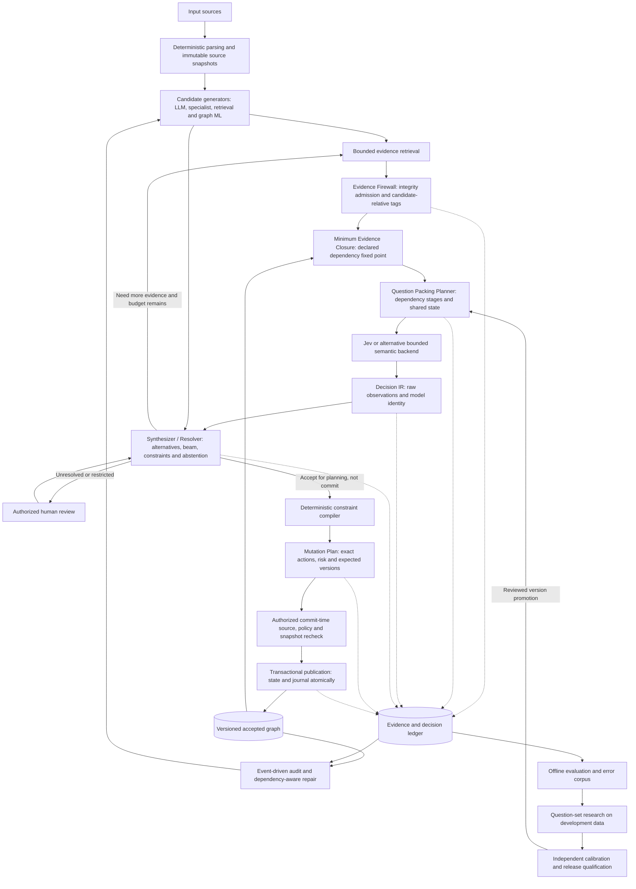
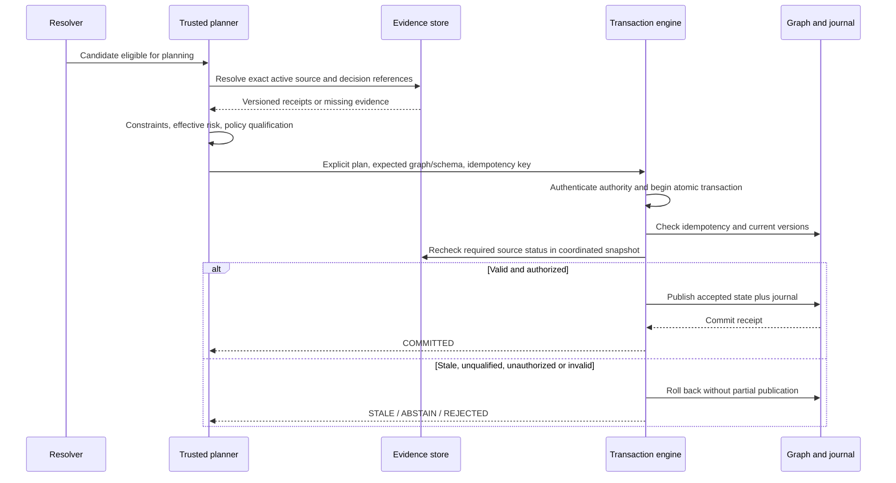
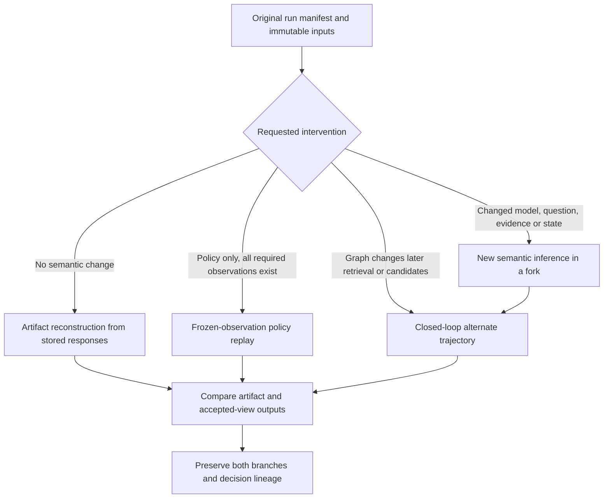

# TRACE-GC — Consolidated Architecture Revision
## Evidence-gated, risk-aware compilation of semantic decisions into repairable graphs

**Prepared:** 25 September 2026  
**Revision:** 0.2-design  
**Deliverable status:** Canonical specification, nine JSON schemas, four Mermaid diagrams, integration roadmap, evaluation and paper framing, plus offline contract checks. The companion ZIP contains the complete editable package.

**Validation:** 42 offline tests passed; zero model calls and zero database commits. These results establish only the specifically tested record contracts, not Jev quality, calibrated deployment thresholds, backend integration or end-to-end synthesis performance.

**Preservation:** The earlier research architecture and inspected durable graph core are the baseline. Original attachments, repository files and frozen empirical results were not overwritten. The attached 27-section revision request is mapped to before/after/why changes below.

**Reading order:** architecture → deltas → IR contracts → risk/calibration → provenance/replay → evaluation → autoresearch → roadmap → paper/novelty → error taxonomy → source register → diagrams.

---

# 1. Canonical architecture specification

## 1.1 Objective and preserved foundation

TRACE-GC is an evidence-gated, uncertainty-aware graph compiler. It transforms proposed semantic structures into explicitly justified, reversible graph mutations. Candidate generators discover possibilities; bounded models judge semantics; a resolver coordinates competing possibilities; deterministic validators enforce declared constraints; an authorized transaction engine alone changes accepted graph state.

This is a revision of the existing design, not a replacement. Preserve the heterogeneous candidate generators, Graph IR, global dependency resolution, transactional graph publication, provenance, event-driven auditing and staged schema evolution described in the earlier report [B1]. Preserve the concrete durable store, exact assertion binding, predicate outcome contracts, non-destructive identity views and dependent-assertion retraction already present in the inspected implementation [B2–B4].

The system must distinguish four different questions: does the quoted source exist; is the source authentic; does that source support this assertion; and is the assertion actually true in the world? A content hash addresses only integrity relative to a stored representation. A semantic support judgment does not answer the other three questions automatically.

## 1.2 Authority boundaries

| Component | Owns | Must not own |
|---|---|---|
| Parsers and source store | Immutable representations, offsets, hashes and retrieval receipts | Semantic truth certification |
| Candidate generators | Proposed entities, predicates, properties, matches and schema alternatives | Accepted graph writes |
| Evidence admission and tagging | Deterministic integrity checks plus fallible relevance/support/risk annotations | Tool permissions or final acceptance authority |
| Closure planner | Declared dependencies, bounded context and snapshot binding | A claim of universally minimal semantic context |
| Packing planner | Scheduling independent questions sharing compatible state | Statistical independence assumptions |
| Jev or alternative judge | Typed semantic observations over supplied state | Orchestration, arithmetic, constraints, credentials or side effects |
| Synthesizer/resolver | Alternative selection, global consistency, abstention and acquisition requests | Bypassing deterministic validation |
| Constraint compiler | Declared structural, temporal and policy checks | Inferring real-world truth from valid structure |
| Mutation planner | Explicit, immutable proposed operations and preconditions | Direct database access on a model's behalf |
| Transaction engine | Authorization, fresh snapshot checks and atomic publication | Trusting model-supplied validation receipts |
| Research controller | Offline experiments and candidate program versions | Editing production questions or thresholds without promotion |

A generative model may help propose an explanation, a new ontology name or a migration candidate. These outputs return to candidate status. A human review similarly adds an attributable decision; it does not bypass graph invariants, access controls or source integrity.

## 1.3 Two related but distinct graphs

Maintain an **evidence and decision graph** containing source snapshots, candidate assertions, typed decisions, supporting and contradicting passages, dependency links, rejected alternatives, transactions and research lineage. Maintain an **accepted graph view** derived from qualified active assertions. Storage can share one backend, but the two views must have different query contracts.

A proposed claim is not accepted merely because it has a node. A rejected or contested claim can remain in the evidence graph. A graph-native predicted link remains a hypothesis unless an explicitly permitted inference rule or qualified evidence path licenses it. Every derived assertion needs its own derivation record and prerequisite references.

For the existing SciFact-derived use case, retain `Document → supports|refutes → Claim` semantics. Do not reinterpret those links as newly extracted biomedical relations. For identity, retain original records and compute a reversible equivalence view; do not delete source records or permanently rewire every edge [B3–B4].

## 1.4 Evidence Firewall: admission, then candidate-relative tagging

The requested Evidence Firewall has two stages. **Admission** verifies readable immutable snapshots, correct source versions, valid spans, tenant permissions and retrieval policy. **Tagging** makes candidate-relative judgments about relevance, support, contradiction, temporal applicability, duplication and instructional content. A bounded semantic model may perform tagging after minimal deterministic admission; this resolves the apparent circularity of placing semantic evidence assessment before the main semantic decision layer.

Use orthogonal axes rather than one mutually exclusive label. One passage may simultaneously support part of a claim, contradict another part, be a duplicated source and contain an adversarial instruction. Preserve the requested category names as tags. Record the classifier and question version producing each semantic tag.

`CONTRADICTING_EVIDENCE` is useful evidence, not a reason to discard a passage. Deduplicate shared origins without erasing alternate retrieval paths. An old source can remain applicable to a historical claim. `STALE_OR_OUT_OF_SCOPE` must be justified relative to the asserted time and scope, not document age alone.

The classifier is not an impenetrable security boundary. Source text remains untrusted even after a benign label. Control instructions, tool permissions and database credentials never originate in retrieved passages. Retrieval execution is subject to application-level destination restrictions, size/time budgets and access checks. Model recommendations cannot relax those restrictions. These are proposed engineering controls, not capabilities provided by the Jev API.

The output is an Evidence IR containing an immutable span reference, deterministic integrity status, candidate-relative semantic tags, source-family metadata and explicit unresolved issues. Invalid or unavailable evidence cannot enter an automatic accepted-fact path. Quarantined material may remain available to an authorized analyst.

## 1.5 Minimum Evidence Closure

Define a question's initial requirement set `R(q)` from its versioned question contract: candidate fields, source spans, ontology fragment, entity alternatives, time qualifiers, declared prior assertions and policy context. Let `deps(x)` return declared dependencies. Compute the least fixed point:

```text
C0(q) = R(q)
C(k+1)(q) = Ck(q) union deps(Ck(q))
stop when C(k+1)(q) = Ck(q)
```

This is a dependency closure, not a proof that the model has every semantically relevant fact in the world. The term Minimum Evidence Closure denotes a design objective and a reproducible declared-dependency contract. Determining the smallest semantically sufficient subset remains an empirical research question.

A valid closure binds a graph snapshot, schema version, source versions, candidate revision and completed upstream decisions. Preserve negation, reference resolution, temporal qualifications, contradictory passages and required entity identifiers. Graph facts used as context carry their assertion status and provenance, so a hypothesis does not become self-confirming evidence.

Remove material only through a logged relevance or dependency decision. A closure budget failure causes partitioning with explicit cross-pack dependencies, retrieval refinement or abstention. It must not silently truncate a required passage. Store the dependency manifest, omission reasons, completeness status and serialized state hash.

## 1.6 Question Packing Planner

Construct a directed graph of question dependencies. Questions whose answers feed other questions cannot occupy the same independent evaluation stage. Within a stage, group questions by compatible closure, security scope, model version, question program and snapshot. Exact shared-state groups are the initial safe implementation; more aggressive union-of-closures packing is a later experiment with an explicit contamination budget.

All references needed by a question belong in its instructions and state. Do not rely on a question-map key to communicate the entity pair or claim target [T2]. Preserve the rendered instruction, ordered option menu, serialized state and request hash. Two requests differing in any of these are different semantic inputs.

Apply the current provider's separate total-request and state-plus-longest-question budgets. The example contract uses conservative operational caps of 64,000 and 32,000 tokens derived from the documentation's 64k/32k limits, not a claim about the provider's internal tokenizer [T1]. Production token estimation must have an identified estimator and margin; synthetic fixture counts are not valid production accounting. Do not assume a 255-question request limit merely because Choice has a 255-option limit [T2].

Packing reduces repeated context only when evidence sharing is real. Measure serialization overhead, question-specific rubric size, latency, failure/retry cost and decision disagreement against unpacked calls. Questions can be runtime-independent while statistically correlated. Keep both distinctions explicit.

## 1.7 Typed semantic judgments and Decision IR

Jev remains a replaceable semantic backend. The adapter preserves the exact request, returned model identity, raw answer, probability distribution, optional raw confidence and operational status before deriving any policy result.

Use Choice for mutually exclusive nominal alternatives such as SUPPORTS, CONTRADICTS and NOT_ENOUGH_INFO within a well-defined claim-span task. Use separate questions for compatible predicates or independently true propositions. Use Score only for genuinely ordered rubrics; its mean is not an observed category. Use Noul for a proposition, with application-derived uncertainty bands kept separate from vendor fields [T2–T4].

An HTTP failure, malformed answer or missing question result is an operational event, not a semantic negative, uncertainty probability or evidence of absence. Fail closed for mutations, retain the error receipt and retry only within an explicit budget. Do not silently renormalize invalid distributions or fill missing probabilities with neutral numbers.

Pin both the model request and expected returned model identity in evaluated programs. A version mismatch invalidates qualification rather than silently inheriting thresholds. Record whether the response was live, recorded or synthetic. A synthetic fixture may imitate the response shape but cannot count as a model observation.

## 1.8 Synthesizer/resolver

The resolver receives Decision IRs, admissible evidence and hard constraints. Its outputs are ACCEPT, REJECT, ABSTAIN, RETRIEVE_MORE_EVIDENCE, HUMAN_REVIEW or CONFLICT_UNRESOLVED. ACCEPT means a candidate is eligible for planning, not committed.

Resolve global identity consistency before using local pair judgments as equivalence relations. A high-scoring A–B match and B–C match cannot override a trusted A–C cannot-link. Preserve competing hypotheses and their evidence rather than averaging them into one supposedly coherent graph probability. A deterministic or learned ranking score can prioritize candidates, but only a separately validated statistical model may label an aggregate a probability.

For hierarchical placement, retain the top `K` feasible alternatives subject to depth, cost and expansion limits. Keep per-step distributions and full candidate paths. A path score is a search score unless separately calibrated. The versioned search configuration must name `beam_width`, `depth_limit`, `minimum_branch_score`, `maximum_expansion_cost`, `maximum_expansions` and `early_stop_policy`. Log every retained and pruned path with its parent, evidence/decision references and pruning reason; require explicit application budgets rather than hidden defaults. Ontologies may be DAGs or multi-label systems: do not force every case into one tree leaf. Include explicit no-match, unresolved and out-of-vocabulary outcomes.

A structured acquisition request names missing evidence, preferred source classes, candidate and question IDs, remaining budget and stop conditions. Repeated identical unresolved requests terminate. Absence from a retrieval shortlist does not establish a new entity. A human reviewer is the final escalation for unresolved or policy-restricted cases, not the destination of every ambiguous local judgment.

## 1.9 Deterministic constraints and transactional publication

Apply constraint checks twice: during plan construction and against current state inside the authorized transaction boundary. Preserve existing domain/range, inverse, symmetry, cannot-link, active prerequisite and exact-scope incompatibility behavior [B4]. Explicitly identify which additional constraints are implemented, delegated to a backend or unsupported.

Do not conflate RDF entailment, RDF validation and property-graph constraints. SHACL validates a graph against declared shapes; PROV-O supplies a provenance vocabulary [W1–W2]. Neither citation establishes that the existing prototype is a complete SHACL processor, OWL reasoner or PROV-O serializer. Arithmetic, interval overlap, keys and referential integrity remain deterministic application/backend duties.

A plan carries exact operations, expected graph/schema versions, source status requirements, assertion and decision references, risk classification, qualification artifacts and authorization state. The transaction engine recomputes preconditions from trusted stores. A model-produced string saying PASS is not a validation receipt.

The engine publishes accepted state and journal entry atomically, or publishes neither. Idempotency fingerprints bind the operation, policy and expected version. A changed payload with a reused key is rejected. Compensating transactions repair later-discovered errors without erasing intervening history. Destructive schema changes require shadow execution, impact analysis and explicit approval.

## 1.10 Conditional invariants and limits

The architecture aims to maintain: every accepted assertion has active traceable evidence or an explicit authorized derivation; every consequential operation passes current deterministic validation; unsupported calibration cannot authorize automatic semantic writes; every inference request and policy decision remains attributable; and revoked support invalidates dependent assertions while preserving alternative independent proofs.

These are conditional software invariants. Their force depends on correct validators, complete dependency declarations, reliable transactions and effective authorization. They do not prove semantic correctness or robustness against an administrator rewriting the entire trusted store. Model uncertainty, retrieval omissions and missing real-world evidence remain substantive failure modes.

## 1.11 Controlled self-improvement

The live compiler consumes an immutable promoted question-set version. Offline research consumes labeled development errors, proposes new questions, tests their incremental value, assesses redundancy and submits a candidate program. Independent calibration and release validation occur before promotion. Final test data do not feed question discovery, thresholds or stopping decisions.

The project may become self-improving through evaluated program revisions; it must not self-authorize new policies. Model upgrades, new question menus, altered closure/packing rules or changes in source population can all invalidate prior calibration. Event-driven auditing prioritizes affected assertions rather than rereading the entire graph continuously.


---

# 2. Architectural deltas and requirement traceability

“Before” below describes the retrieved report and inspected code, not assumed features of an inaccessible repository. “After” is the proposed revision unless explicitly labeled as a package artifact. Baseline sources are B1–B4 in the source register.

| Requirement | Before | After | Why | Revision artifact |
|---|---|---|---|---|
| 1. Evidence Firewall | The report has an Evidence Store and validation; the inspected core verifies stored spans but does not implement retrieval-wide semantic admission. | Add deterministic admission plus candidate-relative semantic/risk tags. Preserve contradictions and duplicate-family lineage. | Makes the evidence boundary explicit without treating a fallible classifier as a security guarantee. | 01_architecture §1.4; evidence schema |
| 2. Claim-to-source verification | core.evidence and GraphStore.commit already bind exact source text, spans and hashes. | Preserve those checks; add raw/extracted representation identities, source versions and semantic support receipts. Recheck active source status at commit. | Existing integrity is useful but is not publisher authentication or factual support. | 03_ir_contracts; 05_provenance_replay |
| 3. Outcome versus confidence | The implementation already has selected labels, distributions and per-predicate outcome contracts. | Add explicit raw confidence, calibration state, resolver action and typed optional fields; keep Noul confidence null. | Prevents a polarity or confidence value from authorizing the wrong relation. | 04_risk_calibration; decision schema |
| 4. Minimum Evidence Closure | The report proposes relevant evidence and dependency links; no executable semantic-minimality guarantee was established. | Add declared-dependency fixed-point closure, scope/version binding, omission receipts and budget failure behavior. | Context minimization must not discard required negation, time or contradictory evidence. | 01_architecture §1.5; question-pack schema |
| 5. Question packing | The report recognizes batched questions; the core is an assertion store rather than a request scheduler. | Add dependency stages, compatible shared-state grouping, two context budgets, per-question targets and exact request hashes. | Controls repeated context costs without assuming answer dependencies are parallel-safe. | 01_architecture §1.6; question-pack schema |
| 6. Probabilities versus scores | The baseline report already rejects naive multiplication of correlated local probabilities. | Preserve local distributions; type ranking/policy scores separately and require a separate artifact for calibrated aggregates. | This is a strengthened contract, not a new probabilistic theorem. | 04_risk_calibration |
| 7. Hierarchical beam search | The report includes hierarchical classification and global resolution but no complete beam contract. | Add bounded alternatives, DAG/multilabel handling, out-of-vocabulary outcomes and non-probabilistic path scores. | Avoids irreversible early errors while measuring expansion cost and contextual effects. | 01_architecture §1.8; 06_evaluation |
| 8. Deterministic constraints | The inspected core checks declared relations, endpoints, symmetric/inverse normalization, cannot-links and active dependencies. | Preserve those checks. Add capability reporting for temporal, cardinality, ontology and backend constraints; never imply unsupported reasoning. | Separates implemented guarantees from aspirational constraint coverage. | 03_ir_contracts; 08_roadmap |
| 9. Explicit synthesizer | The earlier architecture already has a Dependency & Consistency Solver. | Name and specify it as Synthesizer/Resolver; place it after typed observations and before planning. | Clarifies that Jev is not the orchestrator or graph synthesizer. | 01_architecture §1.8 |
| 10. Abstention and acquisition | select_identity already defers on weak/missing candidates and requires positive support for new identity. | Generalize resolver outcomes and introduce budgeted evidence-acquisition requests with loop termination. | No-match retrieval is not proof of a new entity; uncertainty need not go directly to a human. | 01_architecture §1.8; resolution schema |
| 11. Decision IR | bind already stores exact candidate hash, model, request hash, execution mode, selected result and policy version. | Add question/program identities, raw receipt, confidence/probability distinction, costs, latency, calibration and parent/supersession links. | Enables targeted replay without overwriting historical decisions. | 03_ir_contracts; decision schema |
| 12. Exact model version | The report recommends version pinning and the implementation records a model string. | Require requested/returned version agreement for qualified inference and explicit unverified status for legacy missing provenance. | A recorded name alone does not prove the service used the expected version. | 04_risk_calibration; decision schema |
| 13. Empirical calibration | Existing study code includes calibration-only qualification and the repository says no deployment threshold was qualified. | Add task/risk-specific qualification records, independent splits, uncertainty bounds and expiry/drift triggers. | Do not convert exploratory thresholds into production guarantees. | 04_risk_calibration |
| 14. Noul uncertainty bands | The core uses explicit per-predicate thresholds; the request proposes illustrative bands. | Store named bands only when a versioned mapping is qualified; default UNQUALIFIED and abstain. | Example boundaries and 0.5 are not universal application policies. | 04_risk_calibration; risk-policy schema |
| 15. Question-set autoresearch | The baseline calls for experiments; the attachment asks for error-driven question discovery. | Add immutable program versions, development search, selection, separate calibration and locked final test. | Repeated optimization on a nominally held-out set would leak test information. | 07_autoresearch |
| 16. Redundancy analysis | No general redundancy optimizer was established in the inspected graph-store code. | Measure incremental end-to-end value, correlations, tail-risk effects and removal ablations before pruning. | Highly correlated questions can still catch different rare destructive failures. | 07_autoresearch |
| 17. Error-driven research | The earlier study separates entity and evidence-link errors; the attachment supplies a wider taxonomy. | Retain supplied semantic codes and add operational/version/packing/authorization failure classes. | Different failures require different interventions and denominators. | 10_error_taxonomy |
| 18. Decision ledger | GraphStore already atomically journals accepted graph operations and their state hashes. | Add upstream receipt lineage for retrieval, admission, packs, rejected decisions and resolver outcomes. | Graph journals alone do not preserve every rejected or incomplete semantic path. | 05_provenance_replay; ledger schema |
| 19. Counterfactual replay | The existing package preserves exact saved inputs and responses, with replay distinguished from fresh calls. | Specify artifact reconstruction, frozen-observation policy replay, fresh model/program reruns and closed-loop graph reruns. | Changed evidence or retrieval state cannot reuse an old answer as though it were reevaluated. | 05_provenance_replay |
| 20. Transactional reversible mutation | GraphStore has expected versions, idempotency, atomic state/journal publication and retraction. | Preserve core authority; add explicit staged Mutation Plan, dry-run state and compensating plan semantics. | Avoid duplicating the database engine or applying stale inverse operations over later writes. | 05_provenance_replay; mutation-plan schema |
| 21. Operation risk classes | The report distinguishes mutation risk; the current Policy is per-predicate rather than a full R0–R5 registry. | Add minimum risk by operation and contextual escalation by blast radius, sensitivity and schema impact. | A model cannot lower the risk classification of its own proposed operation. | 04_risk_calibration; policies/analysis-only.json |
| 22. Canonical diagram | The earlier diagram already includes graph ML, deterministic branches, global resolution, ledger and audit. | Retain those branches and add admission, closure, packing, explicit resolver, commit recheck and controlled research promotion. | Produces one coherent design rather than a second disconnected pipeline. | diagrams/architecture.mmd |
| 23. Research framing | PGC was proposed as heterogeneous probabilistic compilation with novelty caveats. | Use TRACE-GC consistently; focus the hypothesis on evidence dependency, accepted-mutation risk and replayable program evolution. | A vendor-model substitution or renamed pipeline does not establish novelty. | 09_paper_novelty |
| 24. Evaluation plan | The report already includes architecture/model controls, candidate recall and risk-coverage analysis. | Add matched-coverage/matched-recall reporting, packing and closure ablations, source-family splits and exact error denominators. | Higher precision from accepting fewer candidates is not automatically a better compiler. | 06_evaluation |
| 25. Artifacts | The request enumerates 18 outputs; no machine-readable revision set was supplied. | Create the specification, diagrams, strict schemas, policy, research plans, examples and local checks in this package. | Turns prose requirements into inspectable contracts while marking future runtime integration. | 08_roadmap deliverable matrix |
| 26. Hard rules | Most ownership boundaries already appear in the baseline report and core docstrings. | Turn them into explicit contracts and test cases, with claims limited to implemented checks. | Typed outputs and code-owned commits do not by themselves imply semantic or operational safety. | 01_architecture; tools/validate_package.py |
| 27. Preserve existing work | The research repository separates frozen empirical evidence from broader architecture and later post-hoc studies. | Keep originals immutable, record inspected file hashes, provide additive adapters and before/after mappings; no repository writes here. | Preserves scientific attribution and avoids relabeling unrun improvements as measured results. | 11_sources; README |


## Assumptions explicitly superseded or narrowed

The earlier report left context capacity unspecified; current official documentation supplies two distinct budgets [T1]. A fixed-output cardinality is not a bound on the total number of graph decisions. The model pin in an example is not proof that a request used it. A generic `confidence` field cannot be required as a vendor field for Noul. A Score mean cannot stand in for a nominal middle outcome.

“Minimum” closure is now operationalized over declared dependencies, not asserted as globally optimal semantic context. “Evidence Firewall” means admission and classification, not perfect prompt-injection prevention. “Reversible” means historical preservation plus validated compensation, not universal lossless inversion after arbitrary later operations. “Replayable” does not mean live service calls return identical bytes. “Self-improving” requires a measured, promoted program revision rather than an unconstrained production mutation loop.

The legacy factor-graph formulation remains an optional research path. No globally coherent posterior is claimed for ordinary policy-score resolution. Existing support/refutation links, identity-view semantics, frozen input adapters and the original outcome contracts remain intact.


---

# 3. Intermediate representations and compatibility contracts

## 3.1 Preserve the original representations

Do not create a second incompatible graph store. Preserve Evidence, Candidate, Decision and Mutation as the foundational record families. The Graph IR is the versioned manifest tying those families, schema identity, graph snapshot, resolution and ledger together. Question Pack and Resolution are additional records, not replacements for Candidate or Decision.

The executable schemas are standalone JSON Schema 2020-12 documents. Each prohibits unknown top-level fields and supplies a version identifier. JSON Schema establishes local shape; `tools/validate_package.py` adds selected cross-record checks. Referential integrity, temporal ordering, probability sums, source substring equality and authorization cannot all be delegated to a schema declaration.

| Representation | Essential contract | Legacy mapping |
|---|---|---|
| Evidence IR | Candidate-relative assessment of an immutable source/version/span; integrity, source family, temporal and semantic tags | Preserve `evidence()`; attach sidecar assessments instead of changing frozen source bytes |
| Candidate IR | Exact proposed assertion or identity/type/schema alternative, evidence and prerequisite references, lifecycle status | Preserve `candidate()` shape when lowering supported assertions |
| Question Pack | Dependency-stage state, exact questions, ordered alternatives, scope/snapshot/model and context accounting | New scheduler/adapter layer, not a `GraphStore` responsibility |
| Decision IR | Raw typed answer plus model/request/question/state identity, calibration and policy metadata | Preserve `bind()`'s exact assertion binding; add immutable receipt sidecars |
| Resolution IR | Selected action or abstention/acquisition with alternative, dependency, risk and policy references | Generalize the role above `select_identity()` without redefining its original behavior |
| Mutation Plan | Explicit proposed operations, expected state, evidence/decision refs and authorization/qualification state | Lower to existing `commit`, `retract` or `migrate` only after trusted preflight |
| Graph IR | Manifest of all run records and immutable snapshot/schema identities | Exports/reference index, not a competing graph engine |
| Ledger Event | Stage-specific payload hash, parent event hashes and previous event hash | Link upstream events to the existing atomic graph journal |
| Risk Policy | Versioned per-operation risk and qualified decision rules, or explicit analysis-only behavior | Preserve legacy `Policy` for frozen replay; introduce a qualified policy adapter for new runs |

## 3.2 Evidence addresses

The baseline source span uses Python string indexing. The revision therefore specifies zero-based Unicode-code-point offsets with an exclusive end: `quoted_span == snapshot_text[start:end]`. The hash addresses the exact UTF-8 encoding of that stored text. A separate raw-document hash identifies original bytes when a parser produced a text representation. Do not apply text offsets to PDF bytes, a differently normalized string or another source version.

For parsed documents, retain `representation_id`, parser version and the source-to-text locator mapping. Normalized text used by a model is a new representation, not a silent replacement for the original quote. Structured records may be rendered into deterministic textual projections, with the original field paths and conversion version preserved.

Semantic evidence assessments are candidate-relative and versioned. One source can support candidate A and contradict candidate B. Evidence tags do not independently grant write permission. A hash chain does not authenticate the publisher or prevent a privileged administrator from rewriting all local history.

## 3.3 Questions are semantic programs

A question contract consists of task family, instruction structure, primitive, ordered criteria, referenced state fields, candidate target, expected semantic interpretation, dependency requirements and program version. Changing any element is a semantic program change. Preserve exact rendered requests, not just a human-readable template name.

The package's question schema uses ordered arrays for criteria even where the provider serializes a map. This preserves option presentation for hashing and replay. The adapter lowers Choice options to the provider's criteria map, Score options to the ordered level array and Noul descriptions to true/false criteria. Repeated questions need distinct traceable IDs, but IDs themselves cannot carry information omitted from instructions [T2].

Question dependencies are scheduling dependencies. Statistical dependence is retained as a separate research concern. A later question requiring an earlier answer must use a new pack with that answer in its bound state. A large shared pack is not allowed to smuggle in answers that do not yet exist.

## 3.4 Decision fields and error representation

The revised decision contains `decision_id`, `candidate_id`, `question_id`, `question_schema_version`, `question_hash`, `state_hash`, `request_hash`, `evidence_refs`, provider and requested/returned model IDs, execution mode, raw answer, distribution, raw confidence, semantic outcome, confidence band, calibration reference, policy score, policy/resolver versions, timestamp, latency, cost, request ID, parents, supersession and abstention reason.

Choice and Score raw confidence are preserved exactly as observed. For Noul, raw confidence is null; the application may later attach a calibrated uncertainty band with its own provenance. The binary distribution `{YES:p, NO:1-p}` is an explicitly derived representation of a Noul, not a second model response. Score keeps its expected value and complete ordered distribution; no category is inferred by rounding.

An ERROR decision carries operational status and an error receipt without invented semantic probabilities. Legacy records with missing provider or exact-version evidence remain replayable as historical observations but are not silently promoted into a newly qualified policy population.

## 3.5 Graph assertions and proof structure

Within an assertion, all listed evidence and prerequisite assertions are required: AND semantics. Multiple separately accepted assertions can be alternative proofs of one displayed edge: OR semantics. A source withdrawal invalidates the assertions requiring that source, then their dependents. A view remains if another valid proof supports it.

Document-to-claim support, record equivalence and direct domain relations are different predicate contracts. Maintain direction, canonical inverse, symmetry, allowed endpoint types and qualifiers. Nonexclusive relations must not be forced into one Choice distribution. Inferred transitive edges require explicit inference-rule and premise records, even if the relation has a transitivity annotation.

## 3.6 Compatibility adapter: proposed integration, not implemented here

Implement new-run records alongside the existing core. The trusted adapter should resolve an accepted Candidate IR to the exact legacy `candidate()` bytes, validate its Decision IR and policy qualification, then use `bind()` and construct an explicit plan. Commit lowering can call `GraphStore.commit`; withdrawal lowering can call `retract`; reviewed schema updates can call `migrate`.

A v0.2 Decision IR must not be blindly inserted into the old fact dictionary: the current engine deliberately rejects unknown assertion fields [B4]. Store expanded decision/evidence metadata in sidecars referenced by IDs and hashes, or create a carefully versioned migration after tests. Do not remove strict legacy validation merely to make new fields fit.

Keep the original frozen `Policy` and replay adapter unchanged. A new qualification adapter must not claim that the legacy numerical threshold itself establishes calibrated risk. The new path is disabled for automatic consequential writes until qualification and backend integration tests pass.

## 3.7 Capability declaration

Report each constraint as `IMPLEMENTED`, `DELEGATED`, `UNSUPPORTED` or `NOT_APPLICABLE`, with implementation/version and a result. The inspected core implements exact qualifier-map equality rather than general interval reasoning. Temporal overlap, cardinality, full ontology consistency, RDF shape validation and property-graph backend migration need separate integration. Unknown required capabilities produce an unresolved plan, not PASS.

Local package checks cover data contracts and selected fail-closed invariants. They do not execute the existing database engine, implement a production resolver, authenticate reviewers, or prove complete constraint coverage.


## 3.8 Request-level accounting

A Question Pack carries request-level usage and latency. Decision costs may be null or explicitly allocated shares; never sum full request cost once for every question. Retain billed usage separately from tokenizer estimates. The Resolution IR has an optional search trace containing beam parameters, alternative paths, score types and pruning reasons. A null search trace means hierarchical exploration was not used; it does not mean zero uncertainty.


---

# 4. Risk policy and empirical calibration

## 4.1 Four values, four meanings

Keep the semantic outcome, raw model distribution, raw distribution-derived confidence and application action separate. A policy or resolver score is a fifth value with a separate type. No monotonic transformation, weighted sum or product of local scores is a joint probability merely because it lies between zero and one.

For an ordered Score with levels 0, 1 and 2, both `P(0)=0.5, P(2)=0.5` and `P(1)=1` have mean 1. The first is polarized, the second concentrated. Routing both as an observed “middle” category discards relevant uncertainty. Use a nominal Choice when the task is to choose among meaningfully distinct outcomes. This is a mathematical example, not a claim about an observed Jev run.

Noul has no separate raw confidence field. Choice and Score provide a distribution-derived confidence statistic [T3]. Neither a high score nor a concentrated distribution proves an individual semantic judgment. Preserve the full distribution and evaluate task-specific calibration rather than treating confidence as another independent vote.

## 4.2 Risk classes

| Class | Minimum interpretation | Default in this revision |
|---|---|---|
| R0 | No accepted-graph state change; analysis or routing | Allow bounded analysis and audit recording |
| R1 | Quarantined candidate/support metadata; no promotion to accepted truth | Allow only deterministic integrity and access checks |
| R2 | New ordinary accepted relation or assertion | Automatic acceptance disabled until qualified |
| R3 | Modify, supersede or retract an existing accepted assertion | Qualified policy plus current-state validation; otherwise review |
| R4 | Identity equivalence or entity merge with potentially broad downstream effects | Reversible identity view, cluster/cannot-link checks, precision-focused qualification and review by default |
| R5 | Destructive or global/schema restructuring, mass migration | Shadow analysis and explicit authorization; no automatic deployment in the initial prototype |

These are lower bounds. A supposedly ordinary edge can be high risk in a consequential application. Compute effective risk from operation class, affected-object count, dependent assertions, data sensitivity and downstream use. The same framework does not prescribe a universal acceptable error rate.

A policy author, not a model, approves risk tolerance. A model cannot lower its own proposal's risk. Human review is still constrained by authorization and deterministic graph validity. Trusted source-withdrawal processing may run under an explicitly approved deterministic maintenance policy; it is not equivalent to a model deciding that evidence is false.

## 4.3 Analysis-only default

`policies/analysis-only.json` intentionally contains no production thresholds or qualification artifact. R2–R5 semantic auto-commit is disabled. The example candidate may have apparently strong synthetic probabilities and still ends in ABSTAIN. This is the expected result until the actual task/model/program/population is qualified.

The illustrative confidence ranges in the supplied requirements remain examples only [R1, §14]. `strong_no`, `likely_no`, `uncertain`, `likely_yes` and `strong_yes` become operational only through a versioned mapping learned and validated on appropriate data. Before qualification, the band is UNQUALIFIED; missing calibration does not mean zero or average confidence.

## 4.4 Qualification record

A qualification artifact must bind: task and predicate contract; risk class; source population; requested and observed exact model; full question-set hash; closure and packing policy; candidate generator/blocking version; feature/resolver version; calibration method; development, selection, calibration and test split manifests; evaluation-unit definition; target metric and denominator; confidence-bound procedure; minimum coverage; selected thresholds; date; reviewer; and expiry/drift rules.

Use identity-disjoint or connected-component splits for entity resolution. Group duplicate/source families and shared documents so near-identical evidence does not cross evaluation boundaries. For chronological maintenance, use forward-time evaluation with no future evidence. A random row split is not automatically suitable when multiple rows share the same underlying entity or claim.

Keep four roles distinct: development data for inventing questions; selection validation for comparing candidate programs; calibration data for fitting probability transforms and risk rules; locked test data for the final confirmatory estimate. Small datasets may require carefully documented nested or cross-fitted procedures, but repeated tuning on the final test remains prohibited.

## 4.5 What to measure and qualify

Report classification precision/recall/F1, Brier score, log loss where defined, expected calibration error with binning specified, reliability diagrams and risk-coverage curves. For identity, include false merges, false splits and cluster-level error. For mutation policies, report accepted assertion errors and transaction-level failures separately.

The false automatic mutation rate is incorrect automatically committed actions divided by all automatically committed actions. A false-positive rate is incorrect positive actions divided by gold-negative opportunities. These denominators are not interchangeable. With zero accepted actions, accepted-action risk is undefined, not zero.

Qualification should use an upper uncertainty bound on the approved risk measure and a nontrivial coverage condition, not merely empirical zero errors. Independent negative examples may support an exact binomial treatment; dependent components require a justified cluster-level method. Correct for selection over multiple thresholds and document assumptions. As a sanity check, with zero errors in independent Bernoulli trials, the one-sided upper bound is `1 - alpha**(1/n)`; small samples cannot support extremely small risk claims. This calculation is conditional on the sampling model, not a deployment guarantee.

Separate probability calibration from decision-policy selection. A calibrated classifier can still require conservative abstention for a high-impact merge. A policy that satisfies a particular false-positive criterion may still have poor precision under a different match prevalence. Report sensitivity to deployment class mixtures rather than transferring a convenient benchmark balance into production.

## 4.6 Model and program upgrades

Pin `jev-1.13.0` only for the documented version reviewed here; do not label it permanently latest [T1]. Store requested and returned versions. Aliases are unsuitable for stable calibrated production experiments unless the resolved version is verified and qualification explicitly targets that resolution.

Any change in model, question wording, option menu, demonstrations, retrieval policy, closure composition, packing behavior, resolver features or source population requires a compatibility assessment. A state hash alone cannot justify cache reuse after a changed question. Deploy a new policy version only after regression and qualification checks. Failed checks keep the previous promoted version or switch to analysis/review mode.

## 4.7 Aggregate probabilities and source dependence

A learned resolver may consume Jev outputs, source metadata and graph features. Train and calibrate it as a separate statistical model using out-of-fold or otherwise leakage-controlled features. Log its version and uncertainty assumptions. Until validated, call its output a resolver score.

Sources that copy the same article do not provide independent corroboration. Two prompts over the same model/state are not automatically independent judges. A distinct model family can still share errors. Track source families, question correlation and disagreement, then test whether a second judgment adds conditional predictive value and reduces high-risk errors.


---

# 5. Provenance, mutation protocol and replay

## 5.1 Complete lineage

The lineage path is source snapshot → parsed representation → retrieval receipt → candidate → admission/tagging → evidence closure → question pack → raw decision receipt → resolution → constraint results → mutation plan → graph transaction → accepted view. Rejected and abstained paths remain recorded rather than disappearing from the research denominator.

Use immutable identities and content hashes. Record both graph provenance and decision provenance. Map snapshots/assertions to PROV entities, processing steps to activities and models/services/reviewers to agents where an explicit PROV export is implemented [W2]. The package specifies that mapping but does not claim an executable PROV serializer.

A global append-only event order can support simple replay while parent-event references retain the dependency DAG. Store wall-clock and monotonic timing where available, process/run identity, versions, input/output hashes and previous-event hash. A hash chain detects changes relative to trusted anchors; it is not an authentication mechanism against an attacker who can rewrite every local record. Optional external signatures or anchored audit checkpoints are separate application controls.

## 5.2 Privacy and scope

Exact replay needs source and request bytes, but keeping all text indefinitely may be inappropriate. Record access classification and retention policy. Store secrets outside prompts and logs. If evidence must be removed, retain permitted metadata and a tombstone explaining why exact reconstruction is no longer possible; do not claim byte-exact replay after deleting necessary bytes. A redacted derivative is a distinct representation with its own hash.

## 5.3 Proposed plan lifecycle

```text
DRAFT → RESOLVED → PREFLIGHT_VALIDATED → AUTHORIZED
      → COMMIT_RECHECK → COMMITTED
      → ABSTAIN / REJECTED / STALE / REVIEW_REQUIRED / FAILED
```

The package's synthetic fixture stops at DRAFT and ABSTAIN. Future runtime integration must use the trusted planner and transaction engine to advance states. Schemas alone cannot confer authorization.

A plan includes the expected graph version and schema hash, operation list, explicit evidence/decision/assertion references, prerequisite checks, effective risk, policy/calibration identity, authorization state, and a compensation strategy. No arbitrary Cypher, SQL or executable migration text from a model is accepted as an operation.

Preflight resolves references and computes the affected dependency subgraph. Immediately before publication, recheck source activity, prerequisite activity, current schema, policy version, access rights, idempotency and graph version inside the atomic boundary. A preflight PASS does not remain valid after a concurrent graph change. Source activation/withdrawal must participate in the same transactional registry or an explicitly coordinated revocation-epoch protocol; an unlocked read from a separate service does not establish an atomic source-validity guarantee. Where coordination is unavailable, the contract is only validity as of a recorded source snapshot, with subsequent withdrawal handled as a new repair event. Replan on stale versions; do not silently update the expected version without reevaluating changed dependencies.

The existing store already supports atomic graph-state and journal publication with `BEGIN IMMEDIATE`, version checks and idempotency [B4]. Extend around that mechanism instead of creating a parallel transaction authority. Future scalable backends must demonstrate equivalent invariants independently; full JSON snapshots in the current research store do not establish production performance.

## 5.4 Reversible graph updates

Keep original record identities and assertions. A merge is a derived equivalence view based on active identity assertions and cannot-link constraints. Withdrawing a mistaken identity bridge recomputes the affected view rather than reconstructing deleted records.

Within one assertion, evidence and prerequisite lists are conjunctive. Multiple assertions backing an accepted view are alternatives. For withdrawn roots `R`, repeatedly add assertions depending on any root until a fixed point, then deactivate those assertions atomically. An independently supported view survives. Missing dependency declarations cannot be magically recovered; measure declaration completeness and test it explicitly.

Retraction and restoration are different operations. A later restoration requires a new assertion/decision or validated reactivation policy, not erasure of the retraction event. Compensating operations bind current state and may differ from an old plan's naive inverse after intervening writes. Schema migrations require a reviewed target schema, impact report and shadow validation of active assertions.

## 5.5 Four replay modes

| Mode | What is held fixed | What changes | Valid claim |
|---|---|---|---|
| Artifact reconstruction | Stored evidence, requests, responses, program/runtime and initial state | Nothing semantic | Reconstruct the recorded compiler result to the documented byte or semantic equality criterion |
| Frozen-observation policy replay | Exact prior semantic observations and their inputs | Thresholds or resolver rules not requiring missing judgments | Counterfactual policy output conditional on those observations |
| Semantic rerun | Source snapshot and declared input population | Model, question wording, menu, closure or evidence | New model observations; not reuse of old answers |
| Closed-loop graph rerun | Initial state, source sequence and external experiment controls | Policy/model effects on accepted graph, later retrieval and later candidates | End-to-end alternate trajectory with newly evaluated downstream dependencies |

Changing a source, candidate, question or state invalidates cached observations touching that change. A policy replay can reuse unchanged observations only when the new policy requires no missing inputs. Removing a question that also influenced later retrieval demands a closed-loop rerun, not merely deletion of one feature column.

A new model version needs actual new inference unless the result already exists under an exact matching cache key. No provider determinism is presumed. Fresh repeated calls form a separate variability study. Record stored-request reconstruction separately from semantic equality of graph views and byte equality of serialized artifacts.

## 5.6 Replay manifest and comparators

Bind run ID, parent run, intervention, initial graph snapshot/hash, source manifest, question program, provider/model versions, closure and packing versions, resolver/policy/calibration identities, compiler commit, runtime/dependency lock, canonicalization version, seed where meaningful, response receipts, cost/latency and execution mode.

A comparison reports added, withdrawn, changed and unresolved assertions; identity-component changes; affected source/decision lineages; coverage and semantic error changes when independent labels exist; and rerun cost. Preserve both branches. Deterministically select comparison order and distinguish an observed counterfactual from a speculative unexecuted forecast.

## 5.7 Cache rules

A conservative semantic cache key hashes provider and exact model; exact state bytes; exact questions and ordered criteria; program and parser versions; evidence/source versions; relevant graph/schema snapshot; and execution settings. Tenant/access scope also partitions caches. Recorded synthetic fixtures cannot satisfy live inference cache lookups. Cache hits retain the original observation receipt and create a new reuse event, not a fabricated new API request ID.


---

# 6. Evaluation methodology

## 6.1 Hypotheses rather than presumed improvements

H1: Evidence admission and exact claim-source binding reduce unsupported accepted assertions without an unacceptable recall loss. H2: dependency-bounded closures and compatible packing reduce end-to-end cost at matched semantic quality. H3: global resolution reduces identity/constraint errors compared with independent local thresholds. H4: qualified policies improve selective automation at approved risk. H5: offline question-set optimization improves held-out graph outcomes after accounting for added latency and cost.

Each hypothesis can fail. A specialist classifier may dominate Jev. A larger shared context may improve recall despite higher cost. Candidate generation or global solving may dominate runtime. More precise accepted edges may simply reflect more abstention. These are meaningful results, not reasons to change the success metric after testing.

## 6.2 Two evaluation tracks

**Fixed-candidate track:** Freeze source snapshots, candidate objects, blocking outputs, schema and ground-truth units. Vary evidence processing, semantic backend, resolver and acceptance policy. This isolates acceptance quality and repairs while exposing candidate-recall limitations.

**End-to-end track:** Start from the same source stream and initial graph. Allow each system its candidate-generation strategy under declared resource budgets. Measure discovery, retrieval, selection, compilation and maintenance jointly. Results from the first track do not establish the second.

Reuse the existing bibliographic identity and document-to-claim evidence-link tasks with their original limitations and manifests [B2–B3]. Do not call those tasks unrestricted relation extraction, newly induced ontologies, production graphs or a KARMA replication. Use a fresh locked evaluation set for confirmatory claims about changes designed after inspecting the historical results.

## 6.3 Architecture and model controls

| Arm | Definition | Critical control |
|---|---|---|
| A | Generative model proposes graph edits directly in an isolated evaluation sandbox | No production write permissions; record malformed and unsupported edits |
| B | Same generator plus deterministic graph validation | Hold candidate discovery and evidence fixed where the comparison requires it |
| C | Candidate generator, bounded Jev judgments and existing compiler boundary | Match question meaning, evidence and output actions |
| D | Full proposed TRACE-GC: admission, closure, packing, resolver, constraints and qualified risk policy | Report rejected, missing, failed and abstained cases |
| E | D with an autoresearch-selected question set | Freeze selection and calibration before final test |
| F | Same D workflow with a specialist classifier or another structured-output model | Separates workflow benefit from Jev benefit |
| G | Matched-scope KARMA implementation or clearly labeled KARMA-style baseline | Verify actual implementation, publication version, dataset and scope before claiming replication |

Do not import a published score from a different task into a head-to-head comparison. The original report supplies literature leads; a KARMA reproduction needs its own immutable source/commit and protocol. An actual replication has not been performed for this package.

## 6.4 Data partitions and annotation

Partition entities, source families, claims and connected evidence components before generating prompts. Record exclusions and dropped cross-partition pairs. Use temporal holdout for evolution. Gold annotations must distinguish supported, contradicted, unsupported and genuinely indeterminate cases with scope and time qualifiers.

Double-annotate consequential identity/contradiction cases where feasible, retain adjudication disagreements, and blind annotators to model arm. Synthetic adversarial cases test specified failure modes but do not replace naturally sampled evaluation data. Keep generated challenge labels separate from independent human or reference labels.

The model and resolver never receive evaluation labels. Include a negative control that changes evaluator labels and confirms identical graph output. Inspect duplicate leakage, source copying and entity overlap explicitly. Freeze the question program, schema, candidate universe, model pin, policies and all declared random seeds before final test.

## 6.5 Metrics and exact denominators

| Metric | Definition / reporting requirement |
|---|---|
| Candidate recall | Gold target objects represented among proposed candidates / all gold target objects |
| Evidence retrieval recall | Required annotated evidence retrieved / all annotated evidence required for the task |
| Accepted-edge precision | Correct typed, scoped accepted edges / all accepted edges |
| Accepted-edge recall | Correct typed, scoped accepted edges / all gold edges |
| Candidate coverage | Candidates receiving accepted actions / all candidates, including operational failures in the denominator |
| False automatic mutation rate | Incorrect auto-committed actions / all auto-committed actions; undefined when none |
| False-positive rate | Incorrect positive actions / gold-negative opportunities |
| Transaction failure/corruption | Invalid or partially published transactions / attempted transactions; report kinds separately |
| Identity quality | Pair metrics plus false merge/split counts, cluster metrics, cannot-link violations and affected-cluster size |
| Calibration | Brier/log loss, explicit ECE bins, reliability curves and uncertainty intervals by task/risk/source population |
| Provenance correctness | Assertions with verified source/version/span and correct evidence relationship / audited assertions |
| Repair quality | Correct deactivations, missed dependents, unnecessary removals and survival of independent support |
| Schema quality | Constraint violations, schema churn, migration impact and backward compatibility |
| Operational cost | Per-component and end-to-end billed usage, elapsed/active time, retries, storage and human-review minutes |
| Packing quality | State size, request/question count, estimator error, batch failure rate, per-question disagreement and latency |
| Replay quality | Exact-input recovery, semantic graph equality, artifact-byte equality where specified, and missing-dependency rate |

Polarity matters: accepting a refutation as support is a wrong typed edge and a missed correct edge. Isolation and density are graph-structure diagnostics, not truth metrics. A large graph is not automatically a better graph. Report severe errors and their dependency blast radius, not only average F1.

## 6.6 Matched operating points and statistical analysis

Compare both matched candidate/acceptance coverage and matched recall where attainable. Also report complete risk-coverage frontiers. Keep equal-score groups together, disclose ties and avoid inventing a perfect zero-risk origin when there were no accepted actions. Fix ranking rules without using gold labels.

Use paired comparisons over the same independent evaluation units. If documents/entities share dependencies, resample clusters rather than isolated rows. Report effect sizes and uncertainty intervals, with the bootstrap or statistical model fully specified. Primary outcomes and multiplicity treatment are preregistered for confirmatory studies; exploratory analyses remain labeled exploratory.

For very rare false merges, report absolute errors, affected records and an appropriate upper risk bound. Do not equate lack of a statistically resolved difference with equality. Do not claim better calibration from a single bin or from a vendor's global evaluation. Cost estimates from advertised rates remain estimates unless reconciled against billing.

## 6.7 Required ablations

Remove each of: Evidence Firewall tagging, dependency closure, packing, beam search, calibrated policy, claim-source verification, global identity resolution, independent verifier, and autoresearch. All unsafe variants run only in the sandbox. Keep the raw input and measurement pipeline identical.

Compare one broad prompt against atomic questions; atomic independent judgments against joint inference; and atomic judgments plus global constraints. Compare packed and unpacked exact-question programs, including shuffled question order and unrelated distractor context. Compare individual signals, simple composites and a separately calibrated learned resolver. Include a same-model repeated-judge control to test whether apparent independence is real.

For autoresearch, compare no optimization, rewrite-only, question discovery, redundancy pruning and complete optimization at a common search budget. Evaluate final graph outcomes rather than selecting questions solely by local feature fit.

## 6.8 Adversarial and lifecycle experiments

Test source withdrawal, copied sources, contradictory time periods, forged provenance, injected source instructions, irrelevant high-similarity passages, long required evidence, missing retrieval candidates, nonexclusive predicates, ambiguous identity bridges, stale snapshots, changed schemas and interrupted commits.

Use separate deterministic test oracles for span integrity, dependency closure, cannot-links, transaction atomicity and idempotency. Test legitimate instruction-like quotations so the Evidence Firewall does not erase useful evidence indiscriminately. An adversarial source classifier's score is not an authority test; permissions must remain unchanged even when classification fails.

## 6.9 Scaling and stop conditions

Measure at increasing source, candidate, question, assertion and dependency sizes. Initial tiers may be 1K, 10K and 100K decisions; larger tiers follow only after resource measurement. Keep measured and extrapolated results visibly separate. Report component costs and whether candidate generation, batching, solver work, graph snapshots or human review dominates.

Stop a run when budgets are exhausted, source integrity fails, qualification is absent, requested and returned model differ, or required invariants cannot be evaluated. Record the stopped run in the denominator and manifest. No threshold or extra retry may be introduced after seeing test outcomes without declaring a new exploratory run.


---

# 7. Question-set autoresearch and redundancy analysis

## 7.1 Controlled optimization target

Optimize the semantic program used by the compiler, not Jev's weights. TypeSafe's feature-discovery cookbook already illustrates an LLM proposing semantic questions whose Jev outputs become features for a downstream model [T8]. TRACE-GC adapts this pattern to graph outcomes, dependency-aware evidence and mutation risk; the pattern itself is not a new contribution.

A question-set version contains ordered questions/criteria, task families, required evidence fields, expected answer types, demonstrations, closure and packing policy versions, calibration compatibility and component hashes. Record the authoring model or human, proposal rationale, parent version and target errors. Production consumes only a promoted immutable version.

## 7.2 Search loop

Start from failures in a labeled development corpus. Classify the cause before proposing a semantic question: a missing candidate cannot necessarily be repaired by another verifier, a malformed span needs code, and a stale transaction needs synchronization. Proposals may change retrieval, parsing or rules as separate interventions rather than forcing every fix into Jev.

For a semantic proposal, specify the question, admissible answers, evidence requirements and expected downstream decision effect. Evaluate on development data, recompile the graph under a fixed policy experiment, then compare with the unchanged program. Retain raw observations, source hashes, search cost and both successful and failed proposals.

Use a separate selection set to compare bounded finalists, then freeze the program. Fit calibration and risk rules on separate calibration data. Evaluate once on the locked final test for the confirmatory report. Repeatedly reusing the final test to propose questions would turn it into development data; create a new untouched test before the next confirmatory release.

## 7.3 Selection objectives and safety constraints

The primary goal is approved graph quality at useful automation coverage. Cost and latency are explicit secondary objectives or resource constraints. A candidate program must not be promoted merely because it raises feature accuracy while increasing false identity merges, unsupported assertions, review load or end-to-end expense.

Define non-inferiority or maximum-regression rules before selection, by risk class and important population. Require sufficient evidence for rare severe errors. Use a Pareto comparison across quality, coverage and cost when a single weighted objective would hide policy choices. Weights and risk budgets are application decisions, not values the optimizing model invents.

## 7.4 Redundancy analysis

Measure feature correlation, decision agreement, conditional predictive value, correlated errors, request co-location and cost per useful decision. Perform removal ablations: does dropping question Q change accepted graph errors, abstention, identity components or source-withdrawal behavior? Test both common cases and the targeted rare failures.

Do not remove a question solely because it correlates with another. One may detect a rare subsidiary-versus-parent distinction the other misses. Conversely, retaining dozens of semantically similar questions can amplify a correlated misconception without adding evidence. Keep the smallest set that satisfies the measured performance and risk constraints on the declared population.

## 7.5 Candidate question examples

These are proposed hypotheses, not validated questions: does the source refer to the legal entity or a product brand; are two records different subsidiaries of the same parent; is a relationship historical rather than current; does a statement establish ownership rather than partnership; do apparently conflicting claims concern different populations; and do multiple sources trace to the same original report?

Every question must show incremental held-out value before promotion. Do not infer success from plausibility, an impressive example or the optimizing model's explanation.

## 7.6 Promotion protocol

A release candidate includes its full program, source and split manifests, observed model identities, baseline comparison, error deltas, removal ablations, calibration qualification, resource impact and an approval record. Reject programs that require unsupported evidence, violate packing dependencies or silently broaden mutation permissions.

Promotion changes the active question-program pointer under code/application control. Preserve the prior program for rollback and exact replay. Start with shadow evaluation and a bounded reviewed pilot. Rollback restores the old program for future decisions; it does not erase already committed graph mutations, which need their own audit and repair decisions.

## 7.7 Open improvement questions

Which errors are attributable to retrieval versus semantic judgment? Does added context reduce or increase ambiguity? Can a compact specialist replace a redundant question family? Do packed questions influence one another empirically despite API-level independent evaluation? How much reuse survives changing schemas? Does the optimization overfit rare adversarial examples? These are experimental questions, not capabilities established by the package tests.


---

# 8. Additive implementation roadmap and deliverable coverage

## 8.1 Integration target and preservation rules

The inspected implementation is `CompleteDotTech/paper-package/graph_synthesis/core.py`, blob `68217feec539d37e4a524432c93df035f9a0fe39` [B4]. This is a verified file revision, not an assertion that a particular repository HEAD commit is frozen. Resolve and pin the complete checkout before implementation. Read its contributor instructions and run its existing regression/replay checks before making changes.

The work below is a proposed sequence of additive pull requests, not PRs created or merged in this response. Do not change original raw responses, frozen prompts, source datasets, publication figures or empirical conclusions to make new architecture tests pass.

## 8.2 Dependency-ordered work

| Phase | Proposed work | Dependencies | Exit criteria |
|---|---|---|---|
| P0 — Baseline inventory | Pin checkout, validate original manifest, capture existing replay/tests and document supported operations | None | Historical evidence remains byte-identical; existing failures disclosed rather than silently repaired |
| P1 — Versioned contracts | Add IR sidecars, stable IDs, source representations and strict adapters around existing candidate/bind interfaces | P0 | JSON and cross-record tests pass; legacy replay works unchanged; synthetic mode cannot impersonate live observations |
| P2 — Evidence admission | Add integrity/access gate, candidate-relative semantic tags, duplicate families and contradiction retention | P1 | Tampered or missing spans rejected; copied sources not counted as independent; malicious content cannot alter permissions |
| P3 — Closure and packing | Add declared-dependency closure, topological stages, exact rendered request hashes and provider-budget checks | P1–P2 | Required context never silently truncated; answer-dependent questions split; packed/unpacked experiment is reproducible |
| P4 — Semantic adapters and resolver | Add exact model/request receipts, optional confidence, nominal/ordinal contracts, bounded beam and acquisition states | P3 | Missing/invalid outputs abstain; cannot-links survive identity closure; acquisition terminates on budget; nonexclusive relations preserved |
| P5 — Qualified policies | Add split manifests, per-task calibration, confidence bounds and R0–R5 policy registry | P4 and independent labeled data | No automatic consequential writes without matching qualified artifact; changed program/model invalidates qualification |
| P6 — Plan/commit bridge | Lower reviewed plans to existing GraphStore operations, add preflight and in-transaction rechecks | P4–P5 | Stale state and changed source rejected; idempotency preserved; no partial publication; legacy behavior unchanged |
| P7 — Full ledger and replay | Add upstream event journal, cache lineage, counterfactual branches and source-dependency invalidation | P1–P6 | Recorded replay reproduces expected graph; changed semantic inputs require new observations; independent proofs survive withdrawal |
| P8 — Autoresearch | Development-only question discovery, redundancy ablations, frozen finalists and release qualification | P5–P7 | Locked test inaccessible to optimizer; every promoted question set has documented gain, risk and cost impact |
| P9 — Controlled pilot | Fixed-schema document-evidence and identity tasks; matched candidate/model controls | P0–P8 | Declared risk/coverage goals evaluated with uncertainty; results may support, narrow or reject the hypotheses |
| P10 — Evolution and scale | Reviewed schema migration, interval-aware constraints, scalable backend and event-driven audit | P9 evidence | Separate backend atomicity/load tests; no unsupported extrapolation from the small snapshot store |

Initially preserve `core.py` as the sole graph authority. Candidate new modules might be `contracts.py`, `evidence_firewall.py`, `closure.py`, `packing.py`, `resolver.py`, `qualification.py`, `mutation_planner.py` and `decision_ledger.py`; these names are proposed integration locations, not existing files claimed to have been found.

## 8.3 Acceptance scenarios

A corrupt source span must fail before inference or commit. A contradiction must remain available to the resolver. An unrelated prompt instruction must not alter permitted operations even when tagging misses it. A question targeting entity A must state that target explicitly. A pack exceeding either context budget must split or abstain. A Noul must not acquire a fabricated vendor confidence field. A bimodal Score mean must not be treated as a middle-class observation.

A requested/returned model mismatch must prevent qualified acceptance. A changed question or evidence source must invalidate semantic cache reuse. An unqualified high-scoring synthetic decision must never commit. A same_as chain violating cannot-link must fail. A source withdrawal must deactivate all declared dependents but preserve independent alternative support. A concurrent graph change must invalidate a stale plan. A repeated identical idempotency key must return the original event, while a changed payload under the key fails.

The local package tests implement a subset of these record-level checks. The backend, model-behavior, optimization and scale criteria remain integration/research tests, not completed work.

## 8.4 The 18 requested deliverables

| # | Deliverable | Package location |
|---|---|---|
| 1 | Canonical architecture specification | `docs/01_architecture.md` |
| 2 | Architecture Mermaid diagram | `diagrams/architecture.mmd` |
| 3 | Graph IR schema | `schemas/graph.schema.json` |
| 4 | Decision IR schema | `schemas/decision.schema.json` |
| 5 | Evidence IR schema | `schemas/evidence.schema.json` |
| 6 | Mutation Plan schema | `schemas/mutation-plan.schema.json` |
| 7 | Question Pack schema | `schemas/question-pack.schema.json` |
| 8 | Risk policy specification | `docs/04_risk_calibration.md`; `schemas/risk-policy.schema.json`; `policies/analysis-only.json` |
| 9 | Confidence/calibration specification | `docs/04_risk_calibration.md` |
| 10 | Provenance/decision-ledger schema | `schemas/ledger-event.schema.json`; `docs/05_provenance_replay.md` |
| 11 | Replay specification | `docs/05_provenance_replay.md`; `diagrams/replay.mmd` |
| 12 | Evaluation methodology | `docs/06_evaluation.md` |
| 13 | Error taxonomy | `docs/10_error_taxonomy.md` |
| 14 | Autoresearch design | `docs/07_autoresearch.md`; `diagrams/autoresearch.mmd` |
| 15 | Revised implementation roadmap | This document |
| 16 | Revised paper outline | `docs/09_paper_novelty.md` |
| 17 | Updated novelty/contribution analysis | `docs/09_paper_novelty.md` |
| 18 | Open research questions | `docs/09_paper_novelty.md`, §9.5 |

Additional compatibility outputs are the Candidate and Resolution schemas, transaction diagram, complete before/after table, source register, synthetic fixture, offline validators and manifest.


---

# 9. Revised research framing, paper outline and novelty analysis

## 9.1 Working paper title and research claim

**TRACE-GC: Evidence-Gated, Risk-Aware Compilation of Semantic Decisions into Repairable Graphs**

The proposed system turns heterogeneous candidate evidence into reversible graph mutations through explicit evidence admission, bounded semantic judgments, uncertainty-aware resolution, deterministic constraints and versioned acceptance policies. Jev is one backend for typed judgments, not the system's orchestration or transaction authority.

The central test is whether this separation improves accepted-graph quality, selective automation, repairability and total cost under matched candidate recall and explicit dependency constraints. The architecture can remain useful even if a specialist classifier outperforms Jev. An evidence-preserving compiler should not be defined by loyalty to one model.

## 9.2 Proposed abstract, without invented results

Autonomous graph construction requires more than well-formed model outputs: accepted assertions must remain evidence-bound, constraint-valid and repairable as sources and semantic programs change. We propose TRACE-GC, an additive architecture that separates candidate discovery, source admission, bounded semantic judgments, global resolution and transactional graph publication. Its intermediate representations preserve evidence addresses, raw decision distributions, calibration identity, alternative hypotheses and mutation dependencies. Dependency-bounded context and compatible question packing are treated as compiler optimizations whose semantic and economic effects must be measured. A controlled question-set research loop operates outside production and promotes only independently evaluated program versions. The accompanying evaluation protocol separates fixed-candidate acceptance from end-to-end graph synthesis and measures risk, coverage, provenance, repair and cost. The present revision specifies contracts and offline checks; it does not report a new model experiment, qualified deployment threshold or end-to-end benchmark result.

## 9.3 Contribution analysis

| Element | Status of underlying idea | Possible TRACE-GC contribution | Evidence still required |
|---|---|---|---|
| Passage relevance/support/instruction classification | TypeSafe already documents RAG passage classification [T5] | Candidate-relative multi-axis admission tied to mutation lineage | Recall, contradiction handling and permission-boundary tests |
| Citation/source checking | TypeSafe documents citation checking; baseline code already binds exact spans [T6, B4] | Unified source/representation/decision verification at commit | Tamper and source-withdrawal experiments |
| Question batching | Documented System One usage pattern [T7] | Dependency-safe scheduling with closure, scope and request identities | Packed/unpacked quality and cost study |
| Hierarchical beam exploration | Documented TypeSafe cookbook pattern [T9] | Ontology DAG alternatives resolved under graph constraints | Matched-budget hierarchy and multi-label evaluation |
| Semantic question discovery | Documented feature-discovery pattern [T8] | Graph-level error/cost/risk objective and controlled promotion | Locked-test improvement beyond simpler rewrite baselines |
| Provenance | Established standardized vocabulary in PROV-O [W2] | Decision and mutation lineage integrated with uncertain alternatives | Interoperable export and causal repair tests |
| Graph validation | Established constraint validation; baseline already implements selected rules [W1, B4] | Explicit capability-bound compilation across backends | Backend conformance and migration tests |
| Transactions and retraction | Already implemented in the inspected research core [B4] | Upstream evidence/program lineage and counterfactual graph trajectories | Full dependency completeness and concurrency evaluation |
| Minimum Evidence Closure | Operational proposal in this revision; related to dependency analysis and context selection | A defined dependency contract plus evidence-loss/cost experiments | Formal scope, comparison with simpler context selection and novelty search |
| Typed probabilistic graph compilation | Earlier project thesis [B1], not introduced by this revision | Integrated contract, operational safety boundary and reproducible comparative study | End-to-end evidence and systematic closest-prior-work search |

No item is labeled a proven first. The current verification reviewed the project's actual code and selected official documentation, not an exhaustive systematic review of every new graph paper. The earlier report's literature table remains a set of useful leads; its publication claims and performance comparisons must be reverified before submission. Do not inherit a novelty claim merely because a system uses new terminology.

## 9.4 Revised paper outline

1. **Problem and scope:** accepted graph assertions versus candidate hypotheses; fixed-schema evidence links and identity as initial use cases.
2. **Prior work:** knowledge acquisition/fusion, entity-resolution blocking and global consistency, uncertain data and provenance, validation/transactions, structured semantic judgments and graph-enrichment agents.
3. **Requirements and threat model:** integrity versus authenticity, evidence support versus truth, model authority boundaries and conditional guarantees.
4. **Representation:** Evidence, Candidate, Question Pack, Decision, Resolution, Mutation and Graph IR; immutable identities; AND/OR proof semantics.
5. **Compilation pipeline:** admission, closure, scheduling, semantic adapters, beam/global resolution and bounded evidence acquisition.
6. **Risk and publication:** qualification artifacts, operation risk, deterministic validation, concurrent-state recheck and compensation.
7. **Research loop:** error-driven semantic programs, redundancy, data separation and controlled promotion.
8. **Implementation:** exact reused core and additive components, supported versus unsupported constraints, backend limits and operational modes.
9. **Evaluation design:** fixed-candidate and full-pipeline tracks, same-workflow model controls, scope-matched KARMA comparison, statistical units and budgets.
10. **Results:** only actually executed observations, separate software tests, frozen replay, synthetic challenges and fresh inference; no placeholders disguised as numbers.
11. **Ablations and failures:** candidate recall, context truncation, correlated signals, policy drift, source copying, global identity failures and null results.
12. **Limitations and reproducibility:** licensing/data access, source retention, unresolved calibration, human review, scale and incomplete prior-art coverage.

Keep the current empirical manuscript's findings and dates intact. Add this as a prospective architecture section or separate design manuscript. Update results only after the corresponding experiment has actually run with preserved evidence.

## 9.5 Open research questions

**Evidence sufficiency:** Can a declared closure predict semantic sufficiency, or merely make missing inputs visible? Which relevance filters lose the most counterevidence? What should the system do when credible sources disagree indefinitely?

**Context and packing:** When do extra questions or shared state change model judgments? Is exact closure grouping enough, or does semantic interference require a narrower packing rule? How large is the economic gain after generator, retrieval, solver and storage costs?

**Uncertainty and resolution:** Do local calibrated outputs remain calibrated after candidate selection and global constraints? Can a learned resolver model source dependence without double-counting copied evidence? How should uncertainty be represented in partially resolved identity components?

**Graph semantics:** What is an appropriate assertion-level contract for nonexclusive predicates and temporal scope? How much of schema evolution can be validated before migration? How do RDF and labeled-property-graph backends preserve equivalent provenance and repair behavior without conflating their semantics?

**Program evolution:** Can question discovery improve severe-error rates rather than only average prediction? When does optimization overfit the error corpus? How should changes to question sets trigger selective, rather than total, re-evaluation of the accepted graph?

**Reproducibility:** Which counterfactuals are identifiable from frozen observations, and which require new model calls or a complete trajectory rerun? Can dependency declarations be audited for completeness? What reproducibility remains after source deletion or provider retirement?

**Research value:** Does the integrated architecture outperform a simpler generator plus specialist verifier at matched recall and cost? Would a negative Jev result still support the compiler abstraction? Which claimed contribution survives the strongest contemporary prior-art comparison?


---

# 10. Error taxonomy

Keep the supplied semantic codes and add operational codes rather than folding failures into NOT_ENOUGH_INFO. An incident can carry multiple codes, one primary stage, severity, affected objects, evidence/decision references and a remediation version.

| Code | Primary class | Meaning | Diagnostic |
|---|---|---|---|
| ENTITY_FALSE_MERGE | Semantic/identity | Different entities accepted as equivalent | Cluster precision, merge blast radius |
| ENTITY_FALSE_SPLIT | Semantic/identity | Same entity remains incorrectly separated | Pair and cluster recall |
| WRONG_RELATION | Semantic | Incorrect predicate or direction accepted | Typed-edge precision |
| MISSING_RELATION | Discovery/semantic | Gold relation omitted or rejected | Candidate versus final recall |
| WRONG_ENTITY_TYPE | Semantic | Incorrect entity type assigned | Type precision/recall |
| WRONG_RELATION_TYPE | Semantic | Incorrect mapping to schema predicate | Relation-type accuracy |
| TEMPORAL_ERROR | Semantic/constraint | Incorrect interval or time interpretation | Scoped relation correctness |
| PROVENANCE_MISMATCH | Integrity | Source, representation, version or span differs | Integrity rejection rate |
| SOURCE_CONTRADICTION_IGNORED | Evidence/resolution | Applicable counterevidence omitted or suppressed | Contradiction handling and false commits |
| SCHEMA_VIOLATION | Constraint | Declared schema invalidated | Violation count by rule |
| LOW_CONFIDENCE_AUTO_COMMIT | Policy | Action accepted outside its qualified operating rule | Unauthorized/unsafe acceptance |
| ONTOLOGY_PATH_ERROR | Search | Wrong hierarchy/DAG placement retained | Hierarchical loss and recall |
| RETRIEVAL_FAILURE | Discovery | Required evidence absent from retrieved set | Evidence recall |
| IRRELEVANT_CONTEXT_CONTAMINATION | Evidence | Distractor evidence changes outcome incorrectly | Matched-context error delta |
| DUPLICATE_ASSERTION | Representation | Duplicate assertion identity or unintended duplicate fact | Duplicate and idempotency failures |
| STALE_EVIDENCE | Evidence | Source version/status no longer applicable | Freshness and withdrawal correctness |
| CANDIDATE_OMISSION | Discovery | Gold target not represented before adjudication | Candidate recall ceiling |
| PACK_DEPENDENCY_VIOLATION | Scheduling | Question requires another answer in the same independent stage | Rejected invalid pack count |
| PACK_BUDGET_EXCEEDED | Scheduling | Either request context budget exceeded | Overflow/split rate |
| CLOSURE_INCOMPLETE | Scheduling | Declared prerequisite missing or silently truncated | Closure contract violations |
| QUESTION_TARGET_AMBIGUOUS | Semantic program | Target exists only in map ID or unspecified state | Request-contract rejection |
| MODEL_VERSION_MISMATCH | Provenance | Returned version differs from qualification | Unqualified observation count |
| MALFORMED_DISTRIBUTION | Operational | Wrong labels, nonfinite values or invalid sum | Invalid response rate |
| MODEL_REQUEST_FAILED | Operational | Missing response, transport/rate/service failure | Failure rate and retry cost |
| UNQUALIFIED_POLICY | Policy | No matching independent qualification artifact | Automatic write blocked |
| STALE_GRAPH_VERSION | Concurrency | Graph changed since plan/preflight | Replan/abort rate |
| UNAUTHORIZED_MUTATION | Security | Request lacks effective authorized write capability | Denied write attempts |
| SOURCE_COPY_DOUBLE_COUNT | Evidence | Copied origins treated as independent evidence | Corroboration error |
| DEPENDENCY_UNDECLARED | Provenance | Required assertion omitted from dependency graph | Missed retraction/counterfactual changes |
| SCORE_MEAN_AS_CATEGORY | Semantic program | Expected ordinal value treated as selected nominal class | Program-contract violations |
| TEST_SET_LEAKAGE | Research | Locked evaluation data influenced optimization | Invalidated confirmatory run |
| COUNTERFACTUAL_CACHE_MISUSE | Replay | Changed semantic input reused an incompatible response | Replay invalidation count |

Failures from model input/output, application code and source quality need separate denominators. Record whether a code is independently adjudicated, deterministically detected, reviewer-assigned or model-suggested. The optimizer must not treat its own unverified error labels as gold.


---

# 11. Source register and evidence boundaries

## 11.1 Project sources

**R1 — Supplied revision instructions.** `Pasted text(8).txt` and `Pasted text(9).txt`, both 1,170 lines and byte-identical. One unchanged copy is included as `sources/revision_requirements.txt`; original content IDs are `file_000000005bac81f5ad2dc3dab6f083ae` and `file_0000000073ac81f590db8331747da06b`. The hash is recorded in `SOURCE_MANIFEST.json`. These are requirements, not proof that the requested components already exist.

**B1 — Earlier research architecture.** *Autonomous Graph Synthesis as a Typed Probabilistic Graph Compiler*, saved Library report, content ID `file_0000000065f881f7b40304ecd254ebee`, version 1. Entire rendered report reviewed. Original research cutoff: 17 September 2026. It calls the proposed system PGC. Used for architectural continuity, scope, earlier IRs and evaluation framing; its literature/performance claims are not silently treated as newly independently verified.

**B2 — Existing research package.** [Repository README](https://github.com/CompleteDotTech/paper-package/blob/main/README.md), inspected blob `a6afcbd988d12efc0bf17faf21a40d9977abcdaa`. Distinguishes narrow empirical evidence, exact response replay and broader prospective architecture. Mutable `main` links are navigation aids; the listed blob is the observed file identity.

**B3 — Graph extension and manuscript.** [Graph extension README](https://github.com/CompleteDotTech/paper-package/blob/main/graph_synthesis/README.md), blob `515993d23a36c92c77d2b70e700993b7c109ae86`; [graph overview](https://github.com/CompleteDotTech/paper-package/blob/main/GRAPH_SYNTHESIS.md), blob `89b5ea262dbcef79905b55a5b6647fb11a1d673d`; [graph manuscript](https://github.com/CompleteDotTech/paper-package/blob/main/graph_synthesis/paper.md), inspected relevant methods/status sections. The manuscript response was truncated; no complete-manuscript or complete-repository review is claimed. Methods distinguish support/refutation links, identity views and post-hoc graph analysis from end-to-end synthesis. The manuscript's later update weakens the earlier identity finding; this revision reports no new model-quality numbers.

**B4 — Existing executable graph core.** [core.py](https://github.com/CompleteDotTech/paper-package/blob/main/graph_synthesis/core.py), fully read through two bounded connector requests, blob `68217feec539d37e4a524432c93df035f9a0fe39`. Observed source supports the described span checks, assertion binding, predicate contracts, identity/cannot-link validation, SQLite transactions, idempotency, retraction and journal. The original engine's tests were not rerun in this package.

**Unresolved path.** Fetching `CompleteTech-LLC-AI-Research/typed-probabilistic-graph-compiler/README.md` returned 404 through the connected GitHub tool. No inference is made about its existence or visibility. No files in that path were changed or reviewed.

## 11.2 Current official TypeSafe references

Accessed 25 September 2026. Documentation and vendor examples establish API contracts and design patterns, not independent TRACE-GC quality or calibration results. Example performance, prices and threshold choices are not transferred into this package's empirical claims.

| ID | Primary source | Used for |
|---|---|---|
| T0 | [Documentation index](https://docs.typesafe.ai/llms.txt) | Discovery of current official documentation |
| T1 | [Models](https://docs.typesafe.ai/models) | Exact model identity, alias behavior and the two context budgets |
| T2 | [API reference](https://docs.typesafe.ai/api) | Typed request/response contracts; question IDs not model input; Choice options and Score levels |
| T3 | [Confidence](https://docs.typesafe.ai/confidence) | Distinction between distribution and confidence; Noul lacks separate confidence |
| T4 | [Score](https://docs.typesafe.ai/primitives/score) | Ordered levels and probability-weighted expected value |
| T5 | [Classifying RAG passages](https://docs.typesafe.ai/cookbooks/classifying_rag_passages) | Relevance, evidence, contradiction and instructional-content judgments before generation |
| T6 | [Double-checking citations](https://docs.typesafe.ai/cookbooks/citation_check) | Claim/citation verification pattern |
| T7 | [Speculative fan-out](https://docs.typesafe.ai/patterns/fan-out) | Multiple independent questions sharing state |
| T8 | [Autoresearch feature discovery](https://docs.typesafe.ai/cookbooks/autoresearch_feature_discovery) | Question proposal and downstream feature-model optimization pattern |
| T9 | [Hierarchical classification](https://docs.typesafe.ai/cookbooks/hierarchical_classification) | Retaining and exploring alternative hierarchy paths |
| T10 | [Knowledge graph entity alignment](https://docs.typesafe.ai/cookbooks/entity_alignment) | Candidate-first entity matching and ordinary-code routing |

## 11.3 Standards references

**W1 — W3C, Shapes Constraint Language (SHACL).** [Normative specification](https://www.w3.org/TR/shacl/). Used to identify a graph-validation target; no full SHACL implementation is claimed.

**W2 — W3C, PROV-O: The PROV Ontology.** [Normative specification](https://www.w3.org/TR/prov-o/). Used for provenance entity/activity/agent mapping; no complete serializer is claimed.

## 11.4 What this research pass does and does not establish

This revision verifies selected current official contracts and inspects existing project evidence. It does not rerun the original study, execute KARMA, independently benchmark Jev, qualify a threshold or conduct an exhaustive systematic novelty review. Further literature verification is a submission requirement, not a completed novelty certificate.

Artifact designs and algorithmic refinements are proposals derived from the supplied requirements, the actual baseline and explicit reasoning. They are marked as such rather than attributed wholesale to TypeSafe. Offline fixture numbers are invented test data with SYNTHETIC execution mode, never measured probabilities or deployment recommendations.


---

# Appendix: Editable architecture diagrams

These Mermaid sources are also provided as separate `.mmd` files in the package.

## Canonical architecture



## Transaction protocol



## Controlled question-set research

```mermaid
flowchart LR
    A[Development error corpus] --> B[Propose questions or nonsemantic fixes]
    B --> C[Run bounded development experiments]
    C --> D[Graph recompilation and error-cost analysis]
    D --> E[Redundancy and removal ablations]
    E --> F[Selection validation of bounded finalists]
    F --> G[Freeze semantic program]
    G --> H[Independent calibration and risk qualification]
    H --> I[Locked confirmatory test]
    I --> J[Reviewed promotion or reject]
    J --> K[Immutable production program version]
    D -->|Development feedback only| B
    K --> L[Shadow monitoring and drift detection]
    L --> A
```



## Replay modes



