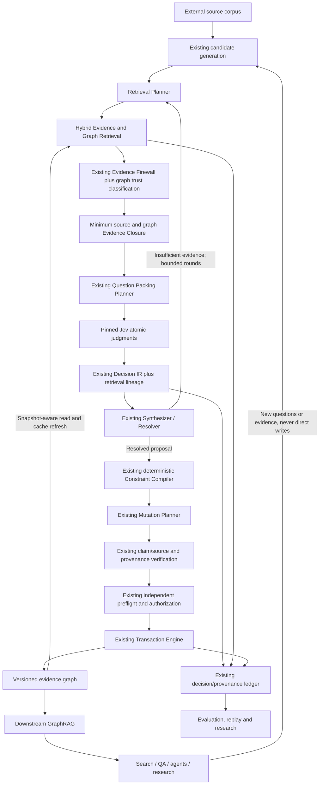

# Canonical architecture — TRACE-GC 0.4.0

> **The graph is both an output of compilation and an input to future compilation.**

TRACE-GC remains the existing evidence-gated typed probabilistic graph compiler. Hybrid source and graph retrieval now constructs bounded, question-specific contexts; Jev supplies atomic semantic judgments; the existing resolver reconciles hypotheses; deterministic compilation enforces graph invariants; and the existing reversible transaction service changes authoritative state. The compiled evidence graph is available both to later compilation and to downstream search, QA and agents.

## One authority, two retrieval roles

The upstream entry point is `UpstreamGraphRAG.run`. It composes **existing** `compile_pack`, fixed semantic questions, observation recording/validation, `solve`, `project_resolutions` and `evaluate_policy`. Its output is analysis and lineage, never an authorization or a graph write. The caller continues through existing `add_operation`, `create_plan`, `CompilerService.preflight` and `CompilerService.publish` with independently enrolled authority.

The downstream entry point is `GraphRAGQueryService.query`. It returns `GraphRAGAnswerContext`: canonical assertions, paths, source spans, compilation provenance, trust classifications and warnings. Its status is `CONTEXT_ONLY`; an application may use that data to construct a cited answer. It does not fabricate prose answers, confer truth, or expose a publication capability.

Both roles share `HybridRetriever`, `GraphQueryAdapter`, ACL filtering, immutable records, ranking, budgets and cache infrastructure. A downstream result cannot be silently repurposed as an upstream pack: the request must be upstream, candidate-bound, tenant-compatible and bound to the same graph snapshot.

The editable source is `diagrams/architecture.mmd`. `diagrams/graphrag.mmd` expands the shared retrieval subsystem.

## Responsibility boundaries

| Component | Responsibility | Explicit non-responsibility |
|---|---|---|
| GraphRAG strategy | Locate potentially relevant graph knowledge. | Decide authoritative graph truth. |
| Hybrid retrieval | Combine authorized source and graph candidates. | Treat a ranking utility as calibrated belief. |
| Evidence Firewall | Check immutable source identities, exact spans, scope and usability. | Infer semantic truth from a valid hash. |
| Graph context verifier | Reconstruct canonical data, classify provenance/status, enforce ACLs. | Make a generated summary a source assertion. |
| Jev | Answer a pinned, bounded semantic or relevance question. | Execute source instructions, authorize publication, or enforce deterministic graph rules. |
| Synthesizer / Resolver | Select compatible hypotheses and preserve abstention/acquisition. | Change graph storage directly. |
| Constraint Compiler | Enforce types, identifiers, cannot-links, dependency and relation rules. | Replace semantic evidence with topology. |
| Mutation Planner | State exact proposed persistent operations and preconditions. | Approve its own operations. |
| Transaction Engine | Recheck authority, versions and source epochs; atomically publish or roll back. | Accept a retrieval result as a write credential. |

**GraphRAG retrieves context. TRACE-GC synthesizes proposed state. The compiler validates structure. The transaction layer alone changes authoritative state.**

## Bounded context without weakening validation

The old compiler behavior is retained when the new arguments are absent. An explicitly retrieval-aware pack uses `graph_context_ids` and `source_retrieval_ids`; passing empty lists is the explicit no-graph ablation, not the legacy full-graph behavior.

For this path the model receives selected canonical graph items, source spans, necessary candidate/claim dependencies and graph version/schema hashes. It does **not** receive the complete graph snapshot. The complete immutable snapshot remains available to deterministic constraint checking and publication preconditions. No graph neighborhood, community, ontology or decision history is automatically dumped into the model state.

The closure remains an exact dependency closure over the selected input set. Selecting the smallest sufficient context is a bounded heuristic, not a claim of globally optimal minimum-set search. Retrieval caps and the existing complete-pack caps both apply.

## Incremental graph compilation

`G0 → compile evidence → G1 → retrieve from G1 → compile new evidence → G2` is an explicit supported lifecycle. Source admission, publication, retraction and permission/status changes reuse the existing backend journal. The next consistent read exposes the new version. Read identity and current source epochs invalidate stale cached results before reuse; the reference adapter rebuilds graph views rather than maintaining a second writable graph.

The baseline source firewall, question semantics, raw observations, exact resolver, policy calibration and trust boundaries have not been replaced. See `20_graphrag_deltas.md` for the material changes and `22_graphrag_traceability.md` for the requirement-to-artifact index.

## Scope of this release

This is an executable single-host reference integration. SQLite and in-memory read adapters run offline; the graph-store protocol supports separately implemented backends. The supplied hashing embedding is a transparent lexical baseline, not a trained semantic model. Full-scale community detection, remote graph adapters, live Jev/provider conformance, deployment calibration and controlled production experiments remain explicit external gates. Existing fixed semantic synthesis remains `supports`, `refutes` and identity; arbitrary new semantic mutation tasks require new reviewed question programs and qualification rather than being silently enabled by GraphRAG.
