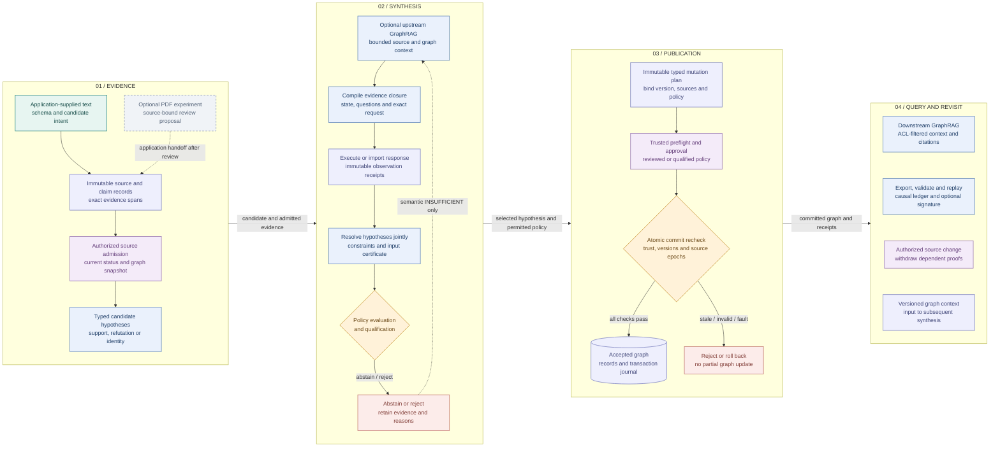

# 01 · From evidence to an auditable graph

[Atlas index](README.md) · [Mermaid source](01-overview.mmd) · [HD PNG](png/01-overview.png) · [Dark PNG](png/01-overview.dark.png)

TRACE-GC compiles evidence-bound hypotheses into typed graph mutations. The application supplies the source material, schema, candidates, trust configuration and execution adapter. Retrieval can enrich the evidence before compilation; publication requires a separate authenticated service. The resulting graph can then supply context for future synthesis and for downstream research queries.

The diagram follows the implemented runtime at commit `d5ca636a48e963619f4c89e2958d0bb1a3e72f80`. Dotted arrows represent optional or explicit application handoffs. A rejected candidate cannot use the reviewed-abstention path.

## Reading the workflow

1. **Establish the evidence.** `Catalog` records immutable source snapshots, claims and exact Unicode evidence spans. The backend admits sources through a signed source-status transaction, then the application constructs typed candidates against a graph snapshot. See [02 · Evidence compilation](02-evidence-compilation.md).
2. **Compile and resolve.** Optional GraphRAG assembles bounded context; `compile_pack` builds a reproducible request. Exact response bytes become observations, and `solve` selects a globally feasible set of hypotheses. See [03 · Observations and resolution](03-observations-resolution.md) and [07 · Upstream compilation](07-upstream-compilation.md).
3. **Authorize and commit.** A selected hypothesis can become a typed plan. `CompilerService` checks application-owned policy and trusted approvals, then repeats publication checks inside the SQLite transaction. An unqualified abstention can proceed only through explicit trusted review; rejection remains a stop. See [04 · Policy and publication](04-policy-publication.md).
4. **Use and revisit the graph.** Downstream queries return source-cited context. Causal bundles support validation and analysis replay. Source withdrawal recomputes dependent proof validity, while independent alternatives can survive. See [05 · History and replay](05-history-replay.md) and [08 · Downstream answers](08-downstream-answers.md).

## What the handoffs mean

| Handoff | Implemented contract |
| --- | --- |
| PDF to runtime | PDF selectors emit review proposals; `prepare_jev_request` produces a reviewed payload or a hold. The application must connect reviewed content to the runtime. There is no single automatic PDF-to-published-graph command. |
| Retrieval to compiler | Query, context, result and closure identifiers accompany the pack, observations and resolutions. Retrieved text and summaries are evidence/context, never publication credentials. |
| Model to resolver | Observations retain primitive outcomes and probabilities separately from vendor confidence; the resolver and policy code determine subsequent action. |
| Plan to accepted graph | The transaction receipt and backend journal establish publication. A local lifecycle state, successful validator call or signed export alone does not commit a plan. |
| Graph to downstream consumer | `GraphRAGQueryService.query` returns `CONTEXT_ONLY`, exact citations and `can_mutate_graph=False`. A consumer supplies any subsequent answer-generation model. |

## Entry points and source evidence

| Code | Role in the end-to-end path |
| --- | --- |
| [`Catalog`](../../trace_gc/catalog.py) | Source, claim, evidence and candidate records. |
| [`build_fixture` / `run_demo`](../../trace_gc/demo.py) | Executable synthetic lifecycle, explicit approvals, duplicate publication and withdrawal. |
| [`UpstreamGraphRAG.run`](../../trace_gc/retrieval/planner.py) | Retrieval, compilation, caller-supplied execution, resolution and bounded expansion. |
| [`CompilerService` / `SQLiteReferenceBackend`](../../trace_gc/backend.py) | Trusted publication service and atomic graph authority. |
| [`run_scenarios`](../../trace_gc/retrieval/scenarios.py) | Identity, contradictory sources, scientific support and uncertainty-expansion examples. |
| [`GraphRAGQueryService`](../../trace_gc/retrieval/service.py) | Provenance-aware downstream context. |
| [`prepare_jev_request`](../../trace_gc/pdf_admission.py) | Review-bound PDF payload admission without an API call or graph mutation. |
| [`test_runtime_workflows.py`](../../tests/test_runtime_workflows.py), [`test_graphrag_pipeline.py`](../../tests/test_graphrag_pipeline.py) | Executable lifecycle and retrieval integration checks. |

The shipped demo uses fabricated inputs, temporary sandbox databases and ephemeral signing keys. Its successful execution proves the reference workflow's exercised contracts; live provider interoperability, production calibration and deployed backend behavior require separate evidence, detailed in [11 · Validation and delivery](11-validation-delivery.md).
