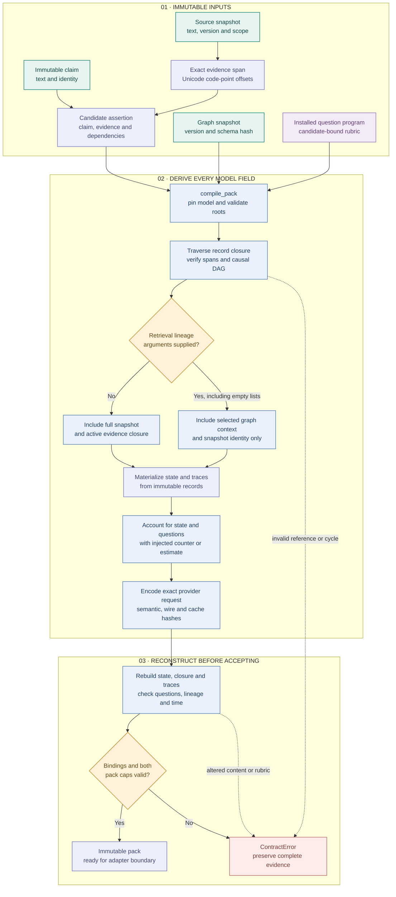

# 02 · Evidence compilation

[Workflow index](README.md) · [Mermaid source](02-evidence-compilation.mmd) · [High definition PNG](png/02-evidence-compilation.png)

The compiler turns immutable evidence into an evaluation request whose meaning and exact transmitted bytes can be reconstructed. This page describes the implementation at `d5ca636`; the catalog and pack are analysis artifacts, and creating them grants no graph write authority.

## Source of each input

| Input | Implemented contract |
| --- | --- |
| Source snapshot | `Catalog.source` stores text, its byte hash, source ID, version and security scope. A new source version has its own immutable record. |
| Evidence | `Catalog.evidence` stores a nonempty `[start, end)` span measured in Unicode code points. `verify_evidence` checks the source record hash, text hash and exact quote. |
| Claim and candidate | `Catalog.claim` identifies the exact claim text. `Catalog.candidate` binds that claim hash to an assertion and evidence. For `supports`/`refutes`, the object must be the claim ID and citations must name the asserted source. |
| Graph snapshot | The compiler uses its graph version, schema identity and assertions. Freshness is checked again at later live and publication boundaries. |
| Question | `programs.question` emits an installed rubric. `verify_question` reconstructs it; changing its wording under the same program version fails. |

`Catalog.add` validates record/body schemas and the hash of `{kind, body}`, then rejects changes to an existing ID. Reads return copies. Hashing uses `TRACE-C14N-1`: a typed binary encoding that distinguishes integers, floats, booleans and signed zero, preserves array order and Unicode spelling, and rejects duplicate JSON keys, nonfinite values, excessive nesting and invalid Unicode. This is the project's own profile, not JSON Canonicalization Scheme.

## Closure and materialization

`closure` traverses candidates, claims, evidence, source snapshots, prior observations, their packs and graph dependencies. Candidate prerequisites must form a DAG; alternative/context links may cycle. A prior observation included as an input must have `status == "OK"`. The closure records its roots, records, typed relationship edges, evidence, sources and a hash; compilation never drops required closure to fit a cap.

With both retrieval arguments omitted, `materialize` includes the full graph snapshot and evidence behind its active assertions. Supplying `graph_context_ids` or `source_retrieval_ids`, even as an empty list, enables bounded materialization: the full snapshot remains available to deterministic code, while the model sees snapshot identity and selected, validated graph context. An explicit empty selection is therefore a meaningful no-graph experiment. Selected context declares `instruction_authority: false`.

Each rendered claim, evidence span and prior answer has a trace back to immutable records, including the declared `identity-v1` or `collapse-whitespace-v1` transformation. `validate_pack` reconstructs state, closure and traces, verifies causal timing and question dependencies, checks run/mode/scope and snapshot bindings, and recomputes request identities before `Catalog.put("pack", ...)` accepts the result.

## Budget and current-state boundaries

The two compiler caps are `state + sum(question sizes) <= request_cap` and `state + longest question <= state_longest_cap`; defaults are 64,000 and 32,000. The default counter measures serialized UTF-8 bytes and is explicitly an offline estimate. Live calls additionally require an injected measured tokenizer, independently recompute accounting and count the complete emitted request. These per-pack checks are separate from the persistent shared run budget in [03 · Observations and resolution](03-observations-resolution.md).

Compilation does not itself admit a source into the backend or query current source status. `validate_pack(..., source_status=...)` rejects inactive, denied or tombstoned sources during fresh use; its historical mode permits provenance inspection of retained source bytes. Retrieval lineage can impose additional current ACL checks. Publication always rechecks current state.

## Code and reviewed tests

- [catalog.py](../../trace_gc/catalog.py): `Catalog.add`, `source`, `evidence`, `candidate`, `verify_evidence`.
- [canonical.py](../../trace_gc/canonical.py): `canonical_bytes`, `digest`, `loads`.
- [compiler.py](../../trace_gc/compiler.py): `closure`, `materialize`, `compile_pack`, `wire_request`, `validate_pack`.
- [programs.py](../../trace_gc/programs.py): `question`, `verify_question`, `retrieval_question`.
- [test_runtime_contracts.py](../../tests/test_runtime_contracts.py): `CanonicalTests`, `BindingTests.test_rendered_quote_cannot_be_rehashed_into_validity`, `test_transitive_closure`, `test_noncausal_alternatives_may_cycle`, `test_exact_codepoint_span`, `test_token_limit_fails_not_truncates`.
- [test_graphrag_pipeline.py](../../tests/test_graphrag_pipeline.py): `test_minimum_closure_materialization`, `test_legacy_pack_unchanged`, `test_no_graph_ablation_is_explicit_empty_selection`.

The tests above were inspected as implementation evidence for this documentation; this page does not report a fresh test run or provider qualification.
