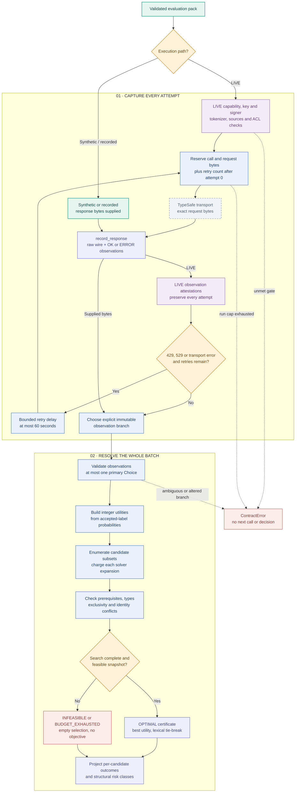

# 03 · Observations and global resolution

[Workflow index](README.md) · [Mermaid source](03-observations-resolution.mmd) · [High definition PNG](png/03-observations-resolution.png)

Evaluation records what a provider actually returned. Resolution then selects a jointly feasible set of candidates. The provider's answer, the resolver's selection and permission to publish remain distinct artifacts. This page follows the implementation at `d5ca636`.

## Evaluation and receipts

`TypeSafeAdapter.evaluate` requires explicit enablement, an externally supplied key, a `LIVE` pack, matching run budget, bounded retry configuration, current source status, an injected tokenizer implementation/version and an observation signer. Graph-context packs additionally require current application ACLs. It validates the pack, counts the actual emitted request and verifies every recorded component count before making a request.

Before **each** attempt, `RunBudget.consume_many` reserves one model call and request bytes; subsequent attempts also reserve a retry. Reservations use their own SQLite `BEGIN IMMEDIATE` transaction. Usage survives reopen, limits cannot be reset for the same run ID, and multiple requested resources are reserved together or not at all. A failed network attempt still consumes its committed reservation. Budget reservations are separate from graph publication transactions.

The adapter sends the exact stored request bytes. `record_response` creates one immutable observation per question, retaining request/response bytes, hashes, safe response headers, HTTP status, raw answers and input lineage. Ordinary HTTP/envelope/model/answer failures become `ERROR` observations with no probability, confidence or semantic outcome; hard receipt limits and invalid input contracts can raise `ContractError` instead. Live observations, including errors, receive signed attestations.

Only HTTP 429/529 and `OSError`/`TimeoutError` trigger retries. `max_retries` defaults to 2 and must be in `[0, 10]`; delays are bounded at 60 seconds. Every attempt remains visible. The adapter returns all attempt observations, so the caller must explicitly choose a retry branch before solving; feeding multiple primary answers for one candidate raises `AMBIGUOUS_PRIMARY_OBSERVATION`. Supersession is recorded explicitly by `record_response` when supplied and must pass identity/time checks.

| Primitive | Preserved semantics |
| --- | --- |
| `CHOICE` | Exact label probabilities, reported choice and raw confidence. Two-decimal provider rounding has a narrowly bounded sum/near-tie tolerance; values are never renormalized. |
| `SCORE` | The full probability distribution and rubric meanings; reported score must equal its expected value. |
| `NOUL` | A yes/no probability derived from `noul`; no separate confidence is invented. |

Recorded or synthetic response bytes can enter through `record_response` without making a network call. Merely importing bytes does not supply the trusted observation provenance required for publication outside the sandbox.

## Whole-batch resolution

`solve` validates supplied observations and constructs a problem from the exact snapshot. `primary_observation` permits at most one `SUPPORT/CHOICE` or `IDENTITY/CHOICE` observation per candidate. Its accepted label is `SUPPORTS`, `CONTRADICTS` for a `refutes` assertion, or `MATCH` for identity; a missing or operationally failed primary answer prevents selection.

Utility is `round(1_000_000 * (2*p - 1))`. The exact subset enumerator checks explicit exclusive groups and `validate_graph`: prerequisite closure, node/relation types, inverse/symmetric normalization, self-relation rules, incompatible qualified facts and transitive identity/cannot-link conflicts. It charges the shared `solver_expansions` budget for every subset. Ties use lexicographic candidate order.

The default expansion cap is 65,536; more than 24 candidates immediately yields `BUDGET_EXHAUSTED`. Invalid base graphs yield `INFEASIBLE`. Any incomplete search clears its selection and objective, producing per-candidate `UNRESOLVED` outcomes. Completed search projects `SELECTED` or `NOT_SELECTED`, together with structural risk. Identity impact counts new implied equivalences and dependent assertions, which can raise identity risk from R4 to R5.

`verify_certificate` rebuilds input bindings, feasibility, objective arithmetic and identity impact, and checks the completed enumeration count. It does **not** independently rerun optimization to prove global optimality, and no certificate grants write authority. [04 · Policy and publication](04-policy-publication.md) contains the next gates.

## Code and reviewed tests

- [adapter.py](../../trace_gc/adapter.py): `TypeSafeAdapter.evaluate`, `record_response`, `parse_answer`, `validate_observation`.
- [budget.py](../../trace_gc/budget.py): `RunBudget.consume_many`, constructor and `close`.
- [resolver.py](../../trace_gc/resolver.py): `primary_observation`, `solve`, `verify_certificate`, `project_resolutions`, `effective_risk`.
- [constraints.py](../../trace_gc/constraints.py): `validate_graph`, `UnionFind`, `impact`.
- [test_runtime_qualification.py](../../tests/test_runtime_qualification.py): `SharedBudgetTests`, `MockTransportTests.test_retry_records_errors_and_signed_success_without_real_network`.
- [test_runtime_contracts.py](../../tests/test_runtime_contracts.py): `ObservationTests`, `test_unresolved_solver_cannot_claim_selection`.
- [test_runtime_workflows.py](../../tests/test_runtime_workflows.py): `test_global_cannot_link_prevents_transitive_identity_contradiction`, `test_exclusive_alternatives_are_joint_not_independent`.

The inspected mock transport tests establish the intended local contract; they do not establish current provider availability, tokenizer qualification or live performance.
