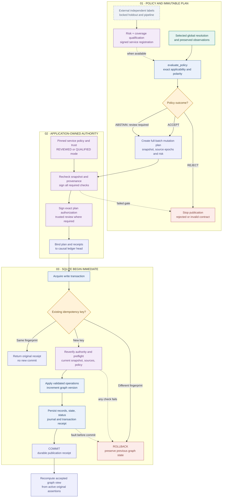

# 04 · Policy, authority and publication

[Workflow index](README.md) · [Mermaid source](04-policy-publication.mmd) · [High definition PNG](png/04-policy-publication.png)

The graph changes only through a configured publication service with a valid plan, trusted receipts and a successful backend transaction. The default policy/service mode is `ANALYSIS_ONLY`. This page documents the local reference implementation at `d5ca636`; it does not authorize or perform publication.

## Qualification and abstention

`evaluate_policy` derives the candidate's complete applicability context from immutable observations and the resolution batch. An incomplete batch yields `ABSTAIN`; a candidate outside a completed selection yields `REJECT`. A selected candidate can receive `ACCEPT` only when an approved qualification applies, its accepted-label probability reaches the threshold, and the reported Choice outcome has the required polarity. Missing, expired, revoked or mismatched qualification yields `ABSTAIN`. An analysis-only policy converts acceptance to abstention.

`evaluate_labels` requires a threshold and pipeline locked before holdout, one independently labeled action per group, disjoint source IDs, and no overlap with development/calibration groups. It measures errors per accepted action, calculates a one-sided exact binomial upper bound and requires both the risk target and minimum coverage. Zero accepted actions cannot qualify a policy. Human or independent external labels are required; sampling representativeness and actual statistical independence still need external review.

`QualificationRegistry.register` requires an enrolled reviewer's signed receipt bound to the qualification bytes, pipeline and scope. Applicability covers task, predicate, population, generator, model, question program, materializer, packing, tokenizer, resolver, policy, risk, security scope and execution mode. The registry and trust enrollment/revocation sets are in-memory application configuration; the host application must manage their durable lifecycle. The package ships no artifact that qualifies a production threshold.

## Plans and review requirements

`create_plan` captures the exact snapshot/schema, source hashes and epochs, qualification/context projections, typed operations and idempotency key. `validate_plan` reconstructs inputs, certificates, evidence and prospective graph constraints. All selected candidates from each included resolution batch must be present; a partial identity component cannot be published.

| Operation | Minimum structural risk | Additional rule |
| --- | --- | --- |
| `ATTACH_CANDIDATE_METADATA` | R1 | Stored separately from immutable candidate semantics. |
| `ADD_ASSERTION` | R2 | Selected candidate, exact observation branch and evidence binding. |
| `RETRACT_ASSERTION` | R3 | **Review required**; assertion revision must match and dependent assertions deactivate transitively. |
| `ADD_IDENTITY_ASSERTION` | R4, possibly R5 | Component certificate required. More than one implied equivalence or any affected dependent assertion raises risk to R5. |
| `PROPOSE_SCHEMA_MIGRATION` | R5 | **Review required**; stores an explicit proposal without applying it. |
| `APPLY_SCHEMA_MIGRATION` | R5 | **Review required**; exact schema impact and existing-node type mapping are checked. |

Every R5 action requires trusted review. `REVIEWED` service mode requires review for every plan. In `QUALIFIED` mode, unreviewed assertion publication must recompute a valid `ACCEPT` through the registry; trusted review may authorize an unqualified abstention, but a `REJECT` cannot be overridden. Synthetic input is accepted only by an explicitly isolated sandbox with trusted review.

## Preflight and commit are separate boundaries

`CompilerService.preflight` compares the plan's full snapshot with the backend, validates current source state and policy/provenance, and signs the ten implemented checks: typed records, exact materialization, complete closure, causal dependencies, global feasibility, current source status, graph/schema version, effective risk, policy applicability and observation provenance. Preflight is a preview and grants no authority by itself.

`authorize_plan` signs the exact plan hash, run/scope/mode, operation IDs/types, qualification IDs and reviewer attribution. `TrustStore` validates Ed25519 signatures against independently enrolled issuer policies, allowed purposes/scopes/modes, expiry, operation permissions and risk ceilings. Private keys and issuer enrollment come from the application. Non-sandbox publication additionally requires observation attestations.

`publish` constructs the causal provenance prefix and then enters `_transaction`. Inside `BEGIN IMMEDIATE`, the backend checks the idempotency key first. The same fingerprint returns the original receipt without a new action; a different fingerprint fails. A new action must match the current graph version and repeats authorization, preflight, snapshot, source epoch, policy, qualification and provenance checks under the write lock.

The backend then applies the prospective state and persists immutable sidecars, state/status, the journal and transaction receipt together. WAL with `synchronous=FULL` is configured. Any exception before commit rolls back the database changes; the caller's in-memory catalog is not itself a database transaction. The journal binds the before/after hashes and upstream ledger head. `view` derives normalized edges and identity representatives from active original assertions, preserving alternative proof records.

The optional `Lifecycle` event chain mirrors `DRAFT → RESOLVED → PREFLIGHT_VALIDATED → AUTHORIZED → COMMIT_RECHECK → COMMITTED`, with guarded rejection/abstention paths. It is a local projection; the committed backend transaction receipt supplies publication evidence.

## Code and reviewed tests

- [qualification.py](../../trace_gc/qualification.py): `evaluate_labels`, `QualificationRegistry`, `context_for`, `evaluate_policy`.
- [policy.py](../../trace_gc/policy.py): `create_policy`, `find_policy`.
- [plans.py](../../trace_gc/plans.py): `create_plan`, `validate_plan`, `deactivate`, `Lifecycle`.
- [trust.py](../../trace_gc/trust.py): `TrustStore`, `authorize_plan`, `verify_authorization`, observation attestations.
- [backend.py](../../trace_gc/backend.py): `CompilerService.preflight`, `publish`, `SQLiteReferenceBackend._transaction`, `view`.
- [test_runtime_transactions.py](../../tests/test_runtime_transactions.py): rollback at every write boundary, stale versions, idempotency, rejected signatures, concurrent writers and published-bundle trust.
- [test_runtime_qualification.py](../../tests/test_runtime_qualification.py): applicability, independent labels, holdout leakage and `test_qualified_automatic_gate_still_requires_authorization`.
- [test_runtime_workflows.py](../../tests/test_runtime_workflows.py): reviewed schema migration, retraction and reversible identity publication.

`SQLiteReferenceBackend` is a single-host conformance backend. Deploying against the pinned legacy GraphStore requires the separate legacy adapter/conformance gate; this workflow review does not establish production deployment readiness.
