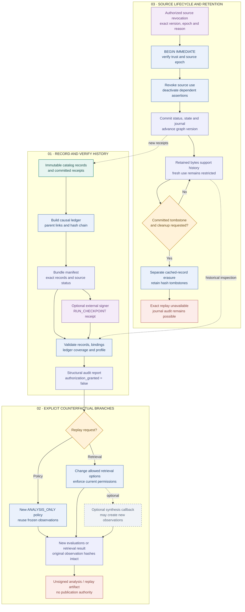

# 05 · History, replay and source withdrawal

[Workflow index](README.md) · [Mermaid source](05-history-replay.mmd) · [High definition PNG](png/05-history-replay.png)

History answers what evidence and decisions produced a result. Replay creates a new analysis branch. Source withdrawal changes what the accepted graph can currently use. These paths preserve separate identities and authority checks in the implementation at `d5ca636`.

## Two connected histories

`ledger.build_ledger` orders every catalog record after its causal references, including hash-bound receipts, prior transactions and retrieval artifacts. Noncausal candidate alternatives are excluded from causal ordering. Each event binds its payload, parent event IDs, preceding hash, run/mode, sequence and stage. A supplied prefix is validated before appending. `make_bundle` records exact record hashes, source-status projections, policy identity and ledger coverage in its manifest.

The SQLite backend journal is the atomic graph history. Each transaction stores before/after state hashes, complete resulting state, source status, record hashes, authorization/preflight hashes and the bound upstream provenance head. `audit` verifies genesis, sequence, hash chain, receipt consistency, persisted record bytes or erasure tombstones, and the current state/status against the last event. `load_catalog` reconstructs persisted records while all required bytes remain available.

A hash chain proves internal consistency. Origin authentication requires a `RUN_CHECKPOINT` signed by an independently enrolled issuer. The checkpoint sits outside the hashed manifest/ledger to avoid recursive hashing; its payload binds the manifest hash and ledger head.

| Bundle profile | Validation behavior |
| --- | --- |
| `PARTIAL_ANALYSIS` | Allows an empty ledger and reports incomplete lineage; record and provenance checks still apply. |
| `FINALIZED_ANALYSIS` | Requires complete ledger coverage; does not grant write authority. |
| `FINALIZED_PUBLISHED` | Rejects synthetic mode; requires transaction/plan binding, authorization and preflight receipts, the committed version and provenance anchor, plus an authenticated external checkpoint. |
| `HISTORICAL_REPLAY` | Requires complete lineage; retained source content may be structurally inspected after withdrawal. Retrieval lineage can retain additional permission requirements. |

`validate_bundle` reconstructs records, references, provenance, questions, observations, plans and certificates before validating ledger coverage. Published artifacts receive additional receipt checks. Its successful result explicitly reports `authorization_granted: false`, zero model calls and zero graph commits; it does not apply a plan.

## Replay paths

`replay_analysis_policy` first validates the original bundle, requires a new `ANALYSIS_ONLY` policy, and appends evaluations for existing resolution batches. Original observations, policies, plans and their hashes remain intact. It does not invoke a model, rerun the resolver, enroll qualifications or sign a checkpoint. Output is unsigned `PARTIAL_ANALYSIS`, or unsigned `HISTORICAL_REPLAY` when the input already uses that profile, and is validated again.

`replay_retrieval` starts from an existing retrieval request/result and allows only named changes such as strategy, hop limit, budget, ranking, graph version, temporal scope and ontology/source filters. Tenant, requesting role and candidate identity cannot be changed through replay options. The retriever enforces current permissions even for a historical graph snapshot. The output records selected-item additions/removals, old/new graph versions, preserved original observation hashes and any newly created observation IDs.

An optional `synthesize(new_result_id)` callback may execute the existing compiler/adapter/resolver path and create **new** observations. Existing observation hashes must remain unchanged. This is the only optional new synthesis step in these replay APIs; the resulting `retrieval-replay` still declares `authorization_granted: false`.

## Withdrawal, retraction and erasure

Initial source admission is itself a signed, versioned `admit_sources` transaction that creates active `READ` status at epoch 0. `change_source_status` then requires a trusted `SOURCE_STATUS` receipt with the exact source/hash, intended status, current graph version, expected epoch and reason. Required issuer permission is `SOURCE_WITHDRAW`, `SOURCE_PERMISSION` or `SOURCE_ERASE`, according to the action.

Inside the transaction, a revocation increments the source epoch and finds affected evidence in the **persisted** backend, so an incomplete caller catalog cannot hide dependencies. `deactivate` marks directly affected assertions and all prerequisite dependents inactive, increasing their revisions. The graph version and journal advance atomically. An independent assertion supporting the same normalized edge can remain active. Restoring source permission/status does not reactivate previously withdrawn assertions; new publication requires a fresh valid plan. Explicit assertion retraction follows the reviewed R3 plan path in [04 · Policy and publication](04-policy-publication.md).

Withdrawal retains source bytes for historical inspection while blocking fresh use. Tombstoning additionally requires inactive status and `DENIED` permission and cannot be reversed through source re-admission. Physical removal is a **separate later transaction**: `erase_cached_content` first verifies a durably committed tombstone, then removes that source and conservatively referenced cached records, retaining ID/hash/kind/reason/time metadata.

After erasure, `load_catalog` fails with `REPLAY_CONTENT_UNAVAILABLE` and cleanup reports `EXACT_REPLAY_UNAVAILABLE`; `audit` can still verify the journal using tombstones. This retention boundary covers only cached records in this backend. It does not erase caller-held catalogs, exports, journal state projections or every possible copy, and makes no claim of complete legal erasure.

## Code and reviewed tests

- [ledger.py](../../trace_gc/ledger.py): `references`, `causal_references`, `build_ledger`, `make_bundle`, `validate_ledger`.
- [validation.py](../../trace_gc/validation.py): `validate_bundle` and profile-specific validation.
- [replay.py](../../trace_gc/replay.py): `replay_analysis_policy`, `replay_retrieval`.
- [backend.py](../../trace_gc/backend.py): `admit_sources`, `change_source_status`, `erase_cached_content`, `load_catalog`, `audit`.
- [plans.py](../../trace_gc/plans.py): `deactivate` and reviewed assertion retraction.
- [test_runtime_transactions.py](../../tests/test_runtime_transactions.py): `test_alternative_proof_survives_one_withdrawal`, `test_inactive_source_is_not_resurrected_by_permission_restore`, `test_revocation_does_not_trust_incomplete_caller_catalog`, `test_erase_revokes_then_reports_exact_replay_loss`.
- [test_runtime_workflows.py](../../tests/test_runtime_workflows.py): `test_policy_branch_retains_exact_observations_and_old_evaluations`, `test_policy_replay_cannot_mint_qualification`.
- [test_graphrag_pipeline.py](../../tests/test_graphrag_pipeline.py): `test_historical_does_not_restore_denied_permissions`, `test_replay_preserves_original_model_receipts`.
- [test_runtime_contracts.py](../../tests/test_runtime_contracts.py): ledger coverage, partial analysis, checkpoint trust and historical provenance tests.

These are reviewed source/test contracts. Fresh rendering and documentation checks are reported in the workflow index; no replay, erasure or graph publication is performed by generating these documents.
