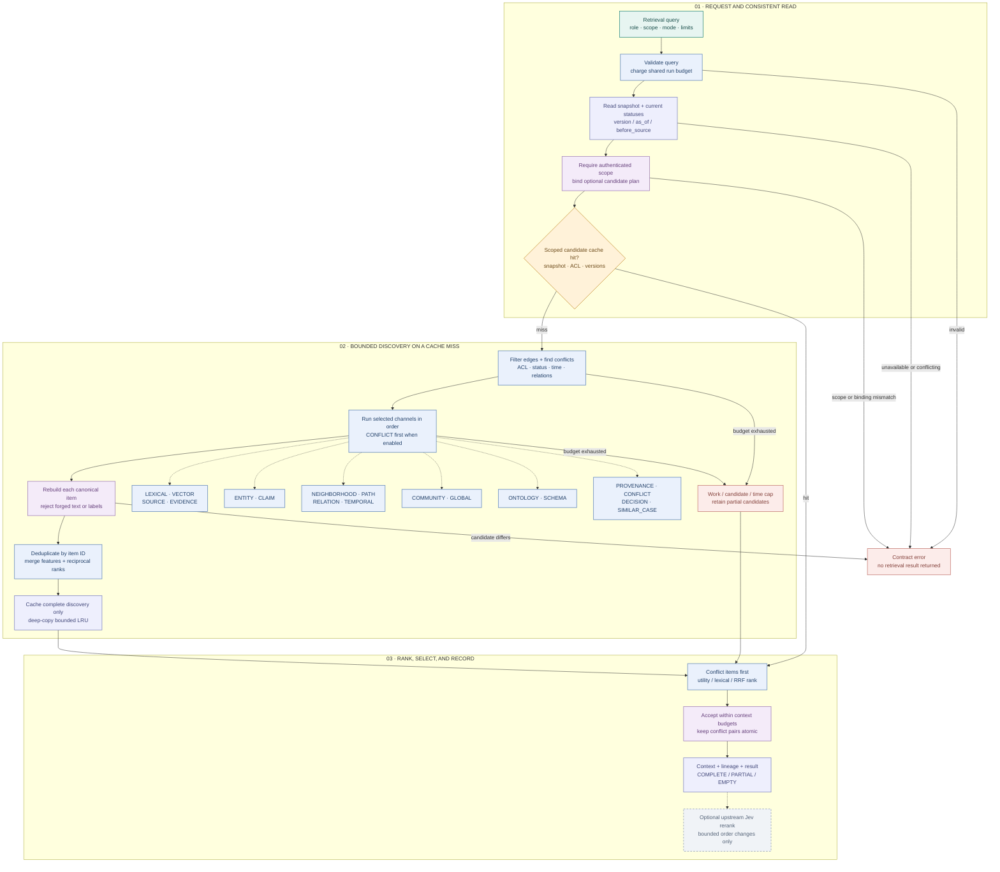

# 06 · Hybrid retrieval

> One request produces bounded, source-derived context and an auditable selection record. Retrieval scores describe ranking utility; they do not authorize graph changes or represent calibrated truth.

[Workflow index](README.md) · [Mermaid source](06-hybrid-retrieval.mmd) · [High-definition PNG](png/06-hybrid-retrieval.png) · [Next: upstream compilation](07-upstream-compilation.md)

Reviewed against revision `d5ca636`.

## Request and snapshot

`HybridRetriever.retrieve` copies the query and runs under the retriever lock. Validation checks the schema, budgets, round and hop bounds, timestamps, disjoint relation allow/deny lists, and installed ranking strategy. A configured shared run budget is charged before the adapter reads the graph. SQLite reads state, journal, catalog, and current source statuses in a consistent read transaction; an in-memory adapter implements the same read-view contract.

An explicit graph version, journal time (`as_of`), or first arrival of a source (`before_source`) selects historical state. Conflicting selectors, missing source history, and unavailable graph versions fail. Historical facts still use **current** source permission and tombstone state. The application supplies access policy; query fields cannot grant access. Exact grants check tenant, workspace, user, roles, and classification, while evidence also passes the existing evidence firewall.

## The 18 channels

The diagram groups channels by purpose. `BuiltinStrategy.retrieve` executes each selected channel **sequentially**; these groups are an inventory, not parallel workers.

| Channels | Actual material retrieved |
| --- | --- |
| `LEXICAL`, `VECTOR` | Original evidence spans matching text terms or positive vector cosine similarity. The default embedding is deterministic token hashing; a pinned embedding implementation can be injected. |
| `SOURCE`, `EVIDENCE` | Original evidence linked to focused graph entities or the candidate, or included by explicit source scope. |
| `ENTITY`, `CLAIM` | Accessible entity records and available claim text matched by focus or text terms. |
| `NEIGHBORHOOD`, `PATH` | Bounded breadth-first traversal over visible edges. Paths contain at least two edges; visited nodes prevent cycles within a path. |
| `RELATION`, `TEMPORAL` | Visible assertion records filtered by relation/focus; temporal selection uses explicit validity qualifiers, a requested time, or historical inclusion. |
| `COMMUNITY`, `GLOBAL` | Bounded connected-component summaries and broad assertion retrieval. Community summaries are deterministic, carry member evidence, and are marked noncanonical. |
| `ONTOLOGY`, `SCHEMA` | Explicitly authorized relation-schema fragments; ontology retrieval can also follow typed ancestry assertions within the hop limit. |
| `PROVENANCE`, `CONFLICT` | Committed proof references and canonical incompatible assertion pairs. Disjoint validity intervals are not simultaneous conflicts. |
| `DECISION`, `SIMILAR_CASE` | Authorized, snapshot-available prior decisions or explicitly historical hypotheses. The current candidate and its in-flight decisions cannot corroborate themselves. |

`PROVENANCE_ONLY` chooses only provenance when enabled; `CONTRADICTIONS_ONLY` chooses conflict retrieval. Otherwise enabled conflict discovery is added when graph channels are requested and runs first. `CONSENSUS` does not suppress contradictions. `LATEST_VALID_STATE` supplies a current `valid_at` when absent and excludes inactive assertions; historical and superseded inclusion remain explicit.

## Filtering, fusion, and limits

Before graph expansion or embedding, the service constructs visible edges using endpoint/edge/source access, readable source status, active/historical/superseded rules, half-open validity intervals, relation filters, and source scope. Source retrieval separately checks access before any evidence text reaches an embedding model. Invalid temporal annotations fail closed.

Every returned candidate is independently reconstructed from canonical records. A plugin cannot alter source text, trust class, provenance, or access labels. The service deduplicates item IDs, merges method membership and features, and accumulates reciprocal ranks (`1 / (60 + rank)`). Final ordering puts conflict items first, then uses evidence utility, lexical utility, or reciprocal-rank fusion, with item ID as a stable tie-breaker.

| Limit family | Enforcement |
| --- | --- |
| Discovery | Latency, work units, candidate count, hop count, and provenance depth bound scans and traversal. Work units are not monetary cost. |
| Selected context | Unique underlying nodes, edges, paths, communities, decisions, and source spans are counted, including members inside paths and summaries. |
| Context size | Token charge is at least the conservative serialized UTF-8 byte estimate, even if an injected counter reports less. |
| Contradictions | A conflict pair must fit together. If excluded, later items containing its members are also blocked, preventing a one-sided remainder. |

Discovery budget exhaustion preserves available candidates and produces a partial result. Selection records each rejection and its reason. Other contract failures propagate. A complete search with no selected material is `EMPTY`; any budget-limited result is `PARTIAL`; successful nonempty selection is `COMPLETE`.

## Cache, receipts, and optional reranking

The bounded, deep-copy LRU stores candidate discovery results, not final authorization decisions. Its key binds the read-view identity, substantive query fields, access policy and source statuses, implementation versions, and retrieval fingerprint. A changed read identity or explicit access-policy refresh invalidates the cache. Partial discovery is never cached. A hit still performs a graph read, sorts and budgets candidates, and creates fresh query, context, lineage, and result records.

Lineage records candidates, features, scores, selected/discarded IDs, usage, cache identity, stop reason, versions, and latency. Optional upstream `JevReranker` processing happens **after** this result: it judges at most `maximum_semantic_items`, creates a new immutable context branch, and adjusts order while preserving every item and conflict priority. See [workflow 07](07-upstream-compilation.md).

## Embeddings and evaluation feedback

[`HashingEmbedding`](../../trace_gc/retrieval/vector.py) is a deterministic 128-dimensional token-hashing baseline. `PrecomputedEmbedding` accepts vectors with an explicit version, and the embedding protocol permits a supplied model. The built-in baseline provides offline retrieval behavior; it does not demonstrate trained semantic-model quality.

[`evaluation.py`](../../trace_gc/retrieval/evaluation.py) measures retrieval precision/recall, reciprocal rank, nDCG, provenance/contradiction coverage, novelty and redundancy; separate helpers measure graph synthesis outcomes and work/latency. Monetary cost remains unset without an external metered provider. `propose_retrieval_changes` returns channel suggestions with `review_required=True`. `heldout_policy_gate` requires disjoint development/holdout groups, a candidate selected on development before checking holdout, sufficient gain and a passed safety flag; its result always has `production_qualified=False`. These research artifacts feed a reviewed experiment, never an automatic runtime-policy rewrite.

## Source map and checks

| Code | Responsibility and inspected tests |
| --- | --- |
| [`contracts.py`](../../trace_gc/retrieval/contracts.py) · `query`, `validate_query`, `RetrievalBudget`, `STRATEGIES` | Request contract and all 18 channel names. |
| [`store.py`](../../trace_gc/retrieval/store.py) · `resolve_version`, `SQLiteGraphAdapter.read`, `GraphReadView.identity` | Snapshot selection, source status, availability, and cache identity. |
| [`security.py`](../../trace_gc/retrieval/security.py) · `AccessFilter` and [`items.py`](../../trace_gc/retrieval/items.py) · `visible_edges`, `conflict_pairs`, `canonical_item` | Access, temporal filters, canonical reconstruction, and provenance classes. |
| [`strategies.py`](../../trace_gc/retrieval/strategies.py) · `BuiltinStrategy.retrieve` | Bounded implementations of the channel inventory. |
| [`service.py`](../../trace_gc/retrieval/service.py) · `HybridRetriever._retrieve`, `effective_strategies`, `RetrievalCache` and [`budget.py`](../../trace_gc/retrieval/budget.py) · `BudgetMeter` | Discovery, fusion, selection, cache, receipts, and limits. |
| [`test_graphrag_retrieval.py`](../../tests/test_graphrag_retrieval.py) | `test_hybrid_deduplicates`, `test_source_acl_checked_before_embedding`, `test_source_permission_revocation`, `test_cache_hit_is_audited`, temporal/version/budget cases. |
| [`test_graphrag_security.py`](../../tests/test_graphrag_security.py) | `test_conflict_pair_budget_never_becomes_one_sided`, `test_custom_counter_cannot_underreport_context`, `test_candidate_cannot_retrieve_itself_as_support`, reconstruction-forgery cases. |

These documents describe the local implementation and inspected tests. They do not establish live embedding quality, production retrieval quality, or remote I/O deadlines; injected adapters must enforce their own I/O deadlines.
