# 07 · Upstream compilation and bounded expansion

> `UpstreamGraphRAG` acquires context for a candidate, compiles exact evidence into semantic questions, and records the resolver and policy outcomes. It returns receipts and a stop reason; publication remains a separate authority boundary.

[Workflow index](README.md) · [Mermaid source](07-upstream-compilation.mmd) · [High-definition PNG](png/07-upstream-compilation.png) · [Previous: retrieval](06-hybrid-retrieval.md) · [Next: downstream contexts](08-downstream-answers.md)

Reviewed against revision `d5ca636`.

```mermaid
flowchart TB
    accTitle: Bounded upstream retrieval, compilation, and semantic evaluation
    accDescr: An upstream candidate receives progressively wider retrieval, optional relevance reranking, complete evidence closure, compiled model input, semantic observations, constraint resolution, and policy evaluation. Each round records lineage and either stops or acquires more evidence without publishing graph changes.

    subgraph acquire["01 · PLAN AND ACQUIRE"]
        Candidate["Candidate + claim<br/>executor + scoped run budget"]:::input
        Scope["Bind candidate and budgets<br/>to the same run"]:::authority
        Remaining{"Retrieval cost and time remain?"}:::decision
        Exhausted["Stop before model execution<br/>retrieval budget exhausted"]:::stop
        Plan["Task + risk plan, tiers 0–4<br/>cumulative channels and hops"]:::process
        Retrieve["Hybrid retrieval<br/>context + result + lineage"]:::process
        Novelty["Charge cost and retrieval time<br/>record new or changed items"]:::process
        Optional{"Reranker supplied<br/>and context has items?"}:::decision
        Rerank["Jev relevance pack + receipts<br/>bounded score/order changes"]:::process
        Candidate --> Scope --> Remaining
        Remaining -->|"no"| Exhausted
        Remaining -->|"yes"| Plan --> Retrieve --> Novelty --> Optional
        Optional -->|"yes"| Rerank
    end

    subgraph compile["02 · COMPILE SOURCE-BOUND MODEL INPUT"]
        Closure["Close candidate dependencies<br/>selected evidence + source spans"]:::process
        Materialize["Materialize exact source text<br/>selected graph items + traces"]:::process
        Pack["Validate and store semantic pack<br/>snapshot + scope + hashes + caps"]:::artifact
        Execute["Execute fixed semantic question<br/>TypeSafeAdapter or test recorder"]:::external
        Binding["Require nonempty observations<br/>bound to this exact pack"]:::authority
        Optional -->|"no"| Closure
        Rerank --> Closure
        Closure --> Materialize --> Pack --> Execute --> Binding
    end

    subgraph decide["03 · RESOLVE, EVALUATE, AND RECORD"]
        Solve["Solve constraints<br/>project candidate resolutions"]:::process
        Policy["Evaluate qualification policy<br/>route semantic INSUFFICIENT"]:::authority
        Stop["Choose stop reason in order<br/>policy · constraints · partial<br/>saturation · maximum rounds"]:::process
        Expansion["Store expansion receipt<br/>novelty · confidence · decision<br/>cost · latency · stop reason"]:::artifact
        Again{"Stop reason set?"}:::decision
        Return["Return UpstreamRun receipts<br/>no graph publication authority"]:::artifact
        Binding --> Solve --> Policy --> Stop --> Expansion --> Again
        Again -->|"no: next round"| Remaining
        Again -->|"yes"| Return
        Exhausted --> Return
    end

    Failure["Contract failure propagates<br/>no fabricated successful run"]:::stop
    Scope -->|"run mismatch"| Failure
    Pack -->|"closure / scope / cap failure"| Failure
    Binding -->|"missing or wrong pack"| Failure

%% BEGIN SHARED ATLAS STYLE
    classDef input fill:#E7F5F1,stroke:#348E82,color:#174D49,stroke-width:1.5px;
    classDef process fill:#EAF1FC,stroke:#6589BB,color:#203F68,stroke-width:1.5px;
    classDef decision fill:#FFF2D9,stroke:#CA963B,color:#6B4918,stroke-width:1.5px;
    classDef artifact fill:#EEEFFD,stroke:#8388C3,color:#414779,stroke-width:1.5px;
    classDef authority fill:#F4EBF9,stroke:#A181B9,color:#643E7A,stroke-width:1.5px;
    classDef stop fill:#FCECEA,stroke:#C57B74,color:#823F39,stroke-width:1.5px;
    classDef external fill:#F0F3F7,stroke:#92A0B2,color:#536277,stroke-width:1.5px,stroke-dasharray:5 4;
%% END SHARED ATLAS STYLE
```

## Plan each round

`UpstreamGraphRAG.run` binds the candidate, caller's run budget, and retriever budget to the same run. Identity candidates default to task `IDENTITY` and risk `R4`; other candidates default to `ASSERTION` and `R2`. The planner also defines policies for claim reconciliation, ontology, temporal, and scientific questions.

Before each round, remaining retrieval cost and accumulated retrieval latency must be positive. The planner combines channel layers through the current tier, raises the hop allowance within its budget, and adds conflict/provenance channels for risk `R4` or `R5` from tier 1 onward. Automatic tiers are 0–4; later permitted rounds stay at tier 4. Defaults allow four rounds, with an absolute configured limit of eight. The query binds the candidate and uses the claim text, assertion endpoints, and relation.

After retrieval, cost and retrieval latency are accumulated. Novelty compares each item's ID plus text, evidence, references, trust class, and current status with previous rounds. This comparison occurs before optional reranking.

## Optional relevance pass

When supplied and context is nonempty, `JevReranker.rerank` compiles a relevance pack for at most the first `maximum_semantic_items`. The executor must return one validated observation per question, bound to that exact pack. Relevant and irrelevant classifications add `+1` and `-1` utility respectively; other outcomes add zero.

The new branch retains all selected items and keeps conflicts first. Its fingerprint binds the base context, reranker, program, model, and item count. Original context and observations remain immutable. Recursive reranking of an already reranked branch is rejected. Relevance is never used as an acceptance probability.

## Complete source closure and semantic execution

`compile_pack` computes the complete dependency closure rooted at the candidate, snapshot, selected graph contexts, and retrieval results. It follows candidate evidence, claims, prerequisites and alternatives, then selected evidence to its original source spans. Materialization carries exact text and field-level traces. The model receives selected graph items and snapshot metadata; the full authoritative graph remains available to deterministic compilation.

Compilation binds candidate, run, execution mode, security scope, graph/schema versions, retrieval fingerprint, semantic input hash, and exact wire-request bytes. It reconstructs the closure and materialized state before storing a pack. A pack over its request/state cap fails; it cannot silently truncate the evidence closure. Pack lineage validation also checks authorized closure sources and candidate endpoints. Passing current access/status into execution-time validation enables fresh revocation checks.

The main semantic question is `IDENTITY` for identity candidates and `SUPPORT` otherwise. The supplied executor is the existing adapter or an explicit test recorder. Nonempty returned observations must reference this pack; then `solve` runs deterministic constraints, `project_resolutions` creates candidate resolutions, and `evaluate_policy` applies qualification policy.

## Exact expansion and stopping order

`request_evidence` first inspects the primary observation. Semantic `INSUFFICIENT` creates a new evaluation requesting more evidence while preserving the original evaluation. Otherwise policy `ABSTAIN` becomes `HUMAN_REVIEW_REQUIRED`; other policy outcomes pass through. Raw confidence is recorded as a diagnostic and planner uncertainty input, not compared with an invented acquisition threshold.

| Priority | Stop behavior after evaluation |
| --- | --- |
| 1 | If acquisition is not requested, stop with the policy action: qualified acceptance, rejection, human review, or the returned action. |
| 2 | If acquisition is requested and the resolution batch is infeasible, stop with `CONSTRAINT_FAILURE`. |
| 3 | A partial retrieval result stops further acquisition with `RETRIEVAL_BUDGET_EXHAUSTED`. |
| 4 | From round 1 onward, no new or changed items stops with `RETRIEVAL_SATURATED`. |
| 5 | Reaching the configured final round stops with `MAXIMUM_ROUNDS`. |

Each completed round stores a `retrieval-expansion` receipt containing previous/current results, decisions, novel information, confidence and decision changes, stop reason, cost, and latency. The returned `UpstreamRun` includes retrieval, expansion, pack, observation, resolution, batch, and evaluation IDs. A zero initial retrieval budget returns an exhausted run without invoking the model.

Contract failures propagate instead of being converted to a successful run. The aggregated latency limit covers retrieval lineage latency; model execution and optional reranker latency are recorded/accounted through their own paths rather than being included in that retrieval total. This coordinator does not create authorization receipts, plans, or graph commits.

## Source map and checks

| Code | Responsibility and inspected tests |
| --- | --- |
| [`planner.py`](../../trace_gc/retrieval/planner.py) · `POLICIES`, `RetrievalPlanner`, `request_evidence`, `UpstreamGraphRAG.run` | Tier planning, round ordering, semantic insufficiency, and stop precedence. |
| [`reranker.py`](../../trace_gc/retrieval/reranker.py) · `JevReranker.rerank`, `validate_reranked_context` | Bounded relevance questions and receipt-derived order changes. |
| [`compiler.py`](../../trace_gc/compiler.py) · `closure`, `materialize`, `compile_pack`, `validate_pack` | Complete dependencies, exact source text, pack validation, and rejection instead of truncation. |
| [`integration.py`](../../trace_gc/retrieval/integration.py) · `lineage_fields`, `validate_pack_lineage`, `resolution_lineage` | Retrieval identity carried through packs, observations, and resolutions. |
| [`resolver.py`](../../trace_gc/resolver.py) · `solve`, `project_resolutions` and [`qualification.py`](../../trace_gc/qualification.py) · `evaluate_policy` | Deterministic resolution and qualified policy outcome. |
| [`test_graphrag_pipeline.py`](../../tests/test_graphrag_pipeline.py) | `test_minimum_closure_materialization`, `test_expansion_on_insufficient_then_resolution`, `test_saturation_stops`, `test_round_cap`, `test_budget_zero_no_model_call`, `test_context_is_not_mutation_authority`. |
| [`test_graphrag_security.py`](../../tests/test_graphrag_security.py) | `test_candidate_source_acl_rechecked_before_model_context`, `test_reranking_can_only_change_receipt_derived_order`, `test_rerank_observation_coverage_required`, `test_rerank_no_recursive_self_reinforcement`. |

The inspected tests use local fixtures and explicit response recorders. Their behavior does not establish live model quality or production qualification.
