# 08 · Downstream evidence and cited answer contexts

> `GraphRAGQueryService.query` returns structured, source-cited context for search, QA, and agents. Its answer record explicitly says `CONTEXT_ONLY`; the implementation contains no free-form answer-generation step.

[Workflow index](README.md) · [Mermaid source](08-downstream-answers.mmd) · [High-definition PNG](png/08-downstream-answers.png) · [Previous: upstream compilation](07-upstream-compilation.md)

Reviewed against revision `d5ca636`.

```mermaid
flowchart TB
    accTitle: Downstream evidence contexts with exact source citations
    accDescr: A downstream request retrieves authorized context, reconstructs canonical items and provenance, produces exact source citations and warnings, and stores a context-only answer with no graph mutation capability. It does not generate a free-form language-model answer.

    subgraph request["01 · REQUEST AUTHORIZED CONTEXT"]
        Input["Search, QA, or agent request<br/>mode + filters + budget"]:::input
        Role{"Component starts with<br/>downstream?"}:::decision
        Reject["Reject request<br/>RETRIEVAL_ROLE"]:::stop
        Retrieve["HybridRetriever.retrieve<br/>snapshot + ACL + budget checks"]:::process
        Result["Load retrieval result<br/>and selected graph context"]:::artifact
        Input --> Role
        Role -->|"no"| Reject
        Role -->|"yes"| Retrieve --> Result
    end

    subgraph verify["02 · RECONSTRUCT AND ATTRIBUTE"]
        Configuration["Validate query, graph version<br/>scope + retrieval fingerprint"]:::authority
        Canonical["Reconstruct canonical items<br/>with current application ACL"]:::authority
        Provenance["Trace matching committed proof<br/>plan · transaction · resolution<br/>observation · evidence · source"]:::artifact
        Budget["Check projections + unique IDs<br/>conservative context budgets"]:::authority
        Citations["Cite every selected evidence span<br/>source ID + hash + offsets + quote"]:::process
        Invalid["Fail context validation<br/>no answer context returned"]:::stop
        Result --> Configuration --> Canonical --> Budget --> Citations
        Provenance -.-> Canonical
        Configuration -->|"binding differs"| Invalid
        Canonical -->|"materialization differs"| Invalid
        Budget -->|"projection or cap differs"| Invalid
    end

    subgraph response["03 · RETURN THE EVIDENCE PACKAGE"]
        Warnings["Preserve retrieval warnings<br/>add conflicts, incomplete proof,<br/>or no authorized context"]:::process
        Answer["Construct graphrag-answer<br/>answer_status = CONTEXT_ONLY<br/>can_mutate_graph = false"]:::artifact
        Catalog["Store immutable answer record<br/>query + result + context IDs"]:::artifact
        Output["Return answer_context_id<br/>and structured context body"]:::artifact
        Consumer["Caller consumes cited context<br/>any further answer generation<br/>is outside this service"]:::external
        Citations --> Warnings --> Answer --> Catalog --> Output --> Consumer
    end

%% BEGIN SHARED ATLAS STYLE
    classDef input fill:#E7F5F1,stroke:#348E82,color:#174D49,stroke-width:1.5px;
    classDef process fill:#EAF1FC,stroke:#6589BB,color:#203F68,stroke-width:1.5px;
    classDef decision fill:#FFF2D9,stroke:#CA963B,color:#6B4918,stroke-width:1.5px;
    classDef artifact fill:#EEEFFD,stroke:#8388C3,color:#414779,stroke-width:1.5px;
    classDef authority fill:#F4EBF9,stroke:#A181B9,color:#643E7A,stroke-width:1.5px;
    classDef stop fill:#FCECEA,stroke:#C57B74,color:#823F39,stroke-width:1.5px;
    classDef external fill:#F0F3F7,stroke:#92A0B2,color:#536277,stroke-width:1.5px,stroke-dasharray:5 4;
%% END SHARED ATLAS STYLE
```

## Request and validation

The service requires `requesting_component` to start with `downstream`, then invokes the same [hybrid retrieval workflow](06-hybrid-retrieval.md) used for upstream evidence acquisition. It loads the result and graph context and calls `validate_context` with the current application-owned access policy.

Validation reconstructs the query, snapshot/version binding, effective strategies, and retrieval fingerprint. It independently rebuilds each selected item from canonical records, including access rules, trust labels, evidence, and provenance. It checks unique IDs, every typed projection, ranking coverage, and conservative context budgets. Forged source text, altered trust, stale version bindings, and inconsistent projections raise contract errors before an answer is returned.

The initial adapter read supplies current source statuses even for historical graph versions. This service's subsequent context validation supplies current ACL but uses the statuses recorded by that read; it does not perform a second atomic source-status read. External reuse of older contexts can supply fresh `current_status` and `current_access` to `validate_context`.

## Provenance and source citations

Graph provenance is derived from matching committed operations and transactions, then authorized resolution/observation records and source evidence. It is not inferred from a nearby edge or a generated summary. Depth limits control how much of this chain is available; incomplete proof remains explicitly classified. Synthetic observations cannot confer `VERIFIED_GRAPH_FACT` through the normal edge classification path.

For each selected evidence ID, the service creates exactly one citation containing:

| Citation field | Origin |
| --- | --- |
| `evidence_id` | Canonical evidence record selected by retrieval. |
| `source_snapshot_id`, `source_hash` | Evidence binding to an immutable source snapshot. |
| `source_id` | Original document identity stored by that source record. |
| `start`, `end`, `quote` | Exact source span and original quote; offsets index stored source text. |

The answer-record validator separately verifies complete citation coverage and exact source identity, hash, offsets, and quote when the record is validated through retrieval integration. It rejects silently removed citations or changed document IDs.

## Result contract

| Returned field | Meaning |
| --- | --- |
| `answer_context_id` | Stored `graphrag-answer` record ID. |
| `context.items` | The exact selected, validated context items, with their trust and provenance metadata. |
| `context.citations` | Original evidence span citations, not generated references. |
| `context.query_id`, `result_id`, `graph_context_id`, `graph_version`, `mode` | Binding to the retrieval request, snapshot, and audit records. |
| `context.answer_status` | Always `CONTEXT_ONLY`. |
| `context.can_mutate_graph` | Always `false`. |

The service preserves retrieval warnings for budget limits, excluded conflict pairs, disabled conflict search, noncanonical summaries, and historical/superseded context. It adds `INCOMPLETE_PROVENANCE_NOT_TRUSTED_TRUTH` for assertion context lacking complete proof, `CONFLICTING_EVIDENCE_PRESENT` when conflicts remain, and `NO_AUTHORIZED_CONTEXT` when no items were selected.

Empty and partial results can still produce an answer context carrying those warnings. No authorization token or write path is introduced. Any consumer that generates natural-language prose from this package implements an additional workflow outside `GraphRAGQueryService`.

## Source map and checks

| Code | Responsibility and inspected tests |
| --- | --- |
| [`service.py`](../../trace_gc/retrieval/service.py) · `GraphRAGQueryService.query`, `validate_context` | Downstream role gate, canonical validation, citations, warnings, and response fields. |
| [`items.py`](../../trace_gc/retrieval/items.py) · `provenance`, `canonical_item` | Committed proof chain, trust classification, and source-derived item content. |
| [`integration.py`](../../trace_gc/retrieval/integration.py) · `validate_record` | Answer/query/result bindings and exact citation coverage. |
| [`test_graphrag_retrieval.py`](../../tests/test_graphrag_retrieval.py) | `test_downstream_has_real_spans_and_no_write_capability`, `test_downstream_refuses_upstream_role`, `test_graph_context_forgery_rejected`, `test_forged_trust_label_rejected`, `test_old_context_fails_current_acl`. |
| [`test_graphrag_security.py`](../../tests/test_graphrag_security.py) | `test_answer_citations_cannot_be_silently_removed`, `test_answer_source_identity_cannot_be_changed`. |
| [`test_graphrag_pipeline.py`](../../tests/test_graphrag_pipeline.py) | `test_complete_committed_provenance`, `test_provenance_depth_cap`, `test_historical_does_not_restore_denied_permissions`, `test_failed_transaction_not_visible`. |

These are implementation and fixture-test boundaries. They do not claim that a downstream consumer's prose is accurate or that live integrations have been exercised.
