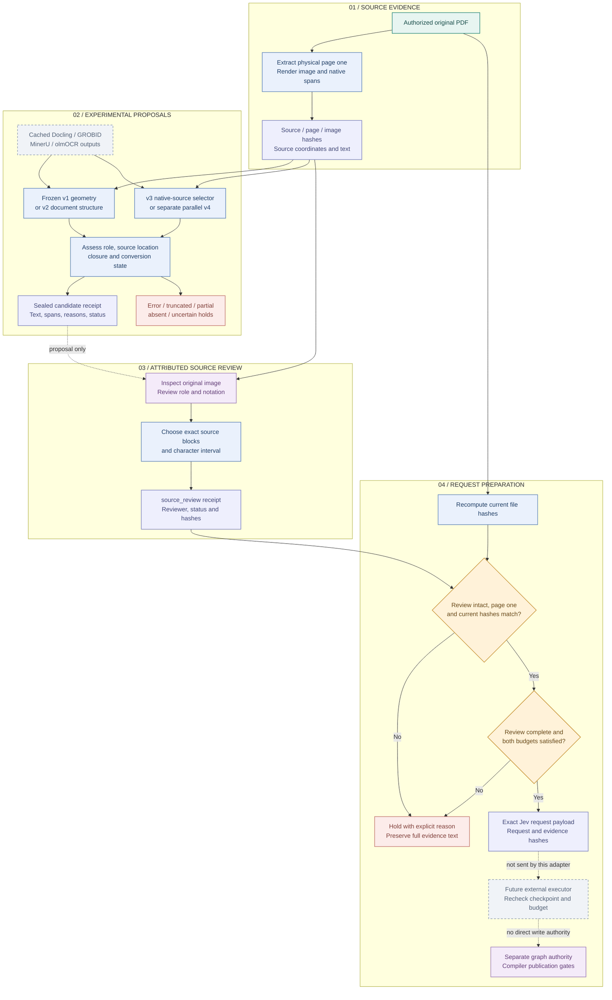

# 09 · PDF evidence and source-review admission

[Atlas index](README.md) · [Mermaid source](09-pdf-evidence-review.mmd) · [High-resolution PNG](png/09-pdf-evidence-review.png)

The PDF modules select evidence from the **first physical page** and produce auditable proposals. The admission adapter can prepare an exact Jev request only from an attributed, complete source review. It performs no API call or graph mutation.

**Status at reviewed revision `d5ca636`: experimental.** V1/v2 eligibility flags are scoring signals; they cannot substitute for a review receipt. V3 and parallel v4 explicitly keep `eligible_for_jev=false` and `verified_admission=false`. Their preservation regressions remain failing; see [research evidence](10-research-experiments.md).

## Workflow

## What each stage does

| Stage | Implemented behavior and source |
| --- | --- |
| Source preparation | [`prepare()`](../../src/parallel_source_v4/prepare.py#L10) reads an authorized local original, copies physical page one, renders it at 120 dpi, records exact native lines and emits hashes plus declared conversion paths. It creates no model predictions. |
| Source verification | [`verify_first_page_bundle()`](../../src/parallel_source_v4/common.py#L76) verifies original/page/image/native bindings in the external harness. Selector functions that receive hashes alone cannot certify that they read those files. |
| Geometry v1 | [`assess_first_page()`](../../trace_gc/pdf_evidence.py#L235) seals five dispositions from page boxes, abstract anchors, metadata exclusions and sentence/layout boundaries; compatible native text may replace the layout transcription. Its completeness assessment remains heuristic. |
| Structure v2 | [`assess_document()`](../../trace_gc/pdf_structure.py#L53) follows the Docling body tree and uses native agreement plus optional scholarly-field corroboration. Native agreement establishes text presence, not its abstract role. |
| Source v3 | [`assess_document()`](../../trace_gc/pdf_source_v3.py#L441) selects exact native character intervals, reconstructs text, requires a structural closure and separately records request budget status. `verify_scholarly_field()` requires located, bounded first-page corroboration. |
| Parallel v4 | [`assess_document()`](../../trace_gc/pdf_structure_parallel_v4.py#L295) combines document regions with [`locate()`](../../trace_gc/pdf_source_parallel_v4.py#L183), exact native spans and explainable boundaries. Ambiguous role, multi-column continuation, style changes and unresolved terminal notation cause holds. |
| Conversion adapters | [V4 adapters](../../src/parallel_source_v4/adapters.py) retain missing/error/truncated conversion states. GROBID fields must be corroborated on page one; olmOCR text must be located in native source. Unlocated text is not assigned a fabricated full-page rectangle. |
| Human or assistant review | [`source_review()`](../../trace_gc/pdf_admission.py#L23) takes a caller-specified ordered set of source blocks and an exact character interval into their space-joined text. It requires reviewer attribution and a nonempty time string, and validates hash format, page geometry, duplicate IDs and disposition consistency. Current source hashes are compared later by `prepare_jev_request`. |
| Request preparation | [`prepare_jev_request()`](../../trace_gc/pdf_admission.py#L65) checks receipt integrity, physical page, current source/page/image hashes, complete review status and whole-request limits. Defaults are 4,000 characters and 16,000 serialized UTF-8 request bytes. |
| Held or prepared output | Failed gates return `admitted=false` with an explicit reason. Success returns the exact payload, request byte count and request/review/evidence hashes. Neither path silently truncates source evidence. |

## Review is a separate decision

A reviewer must inspect page role, abstract boundaries and notation in the source image. Exact native text may still flatten fractions, reorder formula fragments or include body prose. A high string-match score does not resolve those defects. The selector can retain a complete over-budget abstract while independently refusing a request; a model generation limit is a distinct `truncated` conversion state.

Review hashes detect changes but are not signatures or proof of independent review. The admission adapter records `independent_review=false` even for an attributed human reviewer; independence must be established outside this data structure. The current research labels are assistant-reviewed.

The caller must recompute the three current source hashes immediately before preparing a request. The [audit path](../../src/abstract_validation/audit.py#L11) builds reviewed payloads and a reprocessing plan. [`reprocessing_action()`](../../trace_gc/pdf_evidence.py#L246) distinguishes holds, unchanged evaluation reuse and changed/recovered evidence. The repository does not implement an automatic connection from these experimental selectors to the live corpus executor.

Any future executor must reconcile the current checkpoint and budget, retain earlier attempts and charges, and obtain the applicable publication authority. Prepared requests and retrieved papers do not bypass the compiler's policy, signatures, qualification or graph transaction gates.

## Verification coverage

[`test_pdf_admission.py`](../../tests/test_pdf_admission.py) covers candidate-only rejection, exact reviewed text, changed source hashes, tampering, partial/uncertain reviews and both request limits. [V3 model boundaries](../../tests/test_first_page_v3_local_models.py) explicitly reject substituting a selector proposal for a source review. [V4 selector tests](../../tests/test_parallel_source_v4.py) exercise first-page scope, metadata boundaries, duplicate native locations, budget versus generation limits and sealed receipt tampering. These tests check implementation behavior; they do not establish real-paper accuracy.

The source experiment's observed limitations and operational reproduction commands are documented in [the v4 report](../30_first_page_parallel_experiment.md) and [its reproduction notes](../31_first_page_parallel_reproduction.md).
