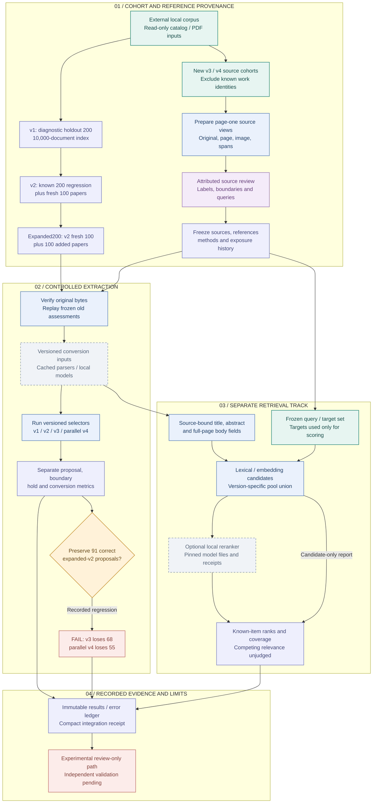

# 10 · Research experiments and recorded evidence

[Atlas index](README.md) · [Mermaid source](10-research-experiments.mmd) · [High-resolution PNG](png/10-research-experiments.png)

These optional experiments evaluate first-page extraction and paper retrieval using external local PDFs, caches and model artifacts. They are separate from the accepted-graph compiler and the active corpus worker. There is no single production scheduler connecting every version; the diagram maps the common process and the versioned experiment lineage implemented in the repository.

**Current recorded gate: FAILED.** On the previously examined expanded200 set, source v3 loses **68 of 91** previously correct v2 proposals; parallel v4 loses **55 of 91**. The v4 integration receipt explicitly says `EXPERIMENTAL_PRESERVATION_GATE_FAILED`. Automatic fallback and promotion remain disabled. Successful unit tests do not clear this empirical gate.

## Workflow

## Versioned experiments

| Path | Cohort and implemented stages | Meaning of the recorded evidence |
| --- | --- | --- |
| [V1 harness](../../src/abstract_validation) | `prepare.main()` selects 200 fresh diagnostic works from a read-only corpus catalog and a 30,000-work distractor pool. `extraction_trial.freeze()` binds selector code; `references.freeze()` materializes manually reviewed source spans. Separate extraction and retrieval evaluators score a 10,000-work index. | The [v1 report](../23_first_page_validation.md) records 122 correct of 136 proposed admissions for geometry v1 on the fresh200 set, and known-item embedding retrieval on 100 queries. These are historical measurements of that protocol. |
| [V2 harness](../../src/abstract_validation_v2) | `prepare.main()` selects 100 previously unreviewed works, split evenly between prior `ok` and `no_abstract` states. Docling/GROBID, structure v2, a 40-page local vision pilot, field extraction, embeddings and reranking have separate scripts. References, queries, revisions and settings are frozen. | The [v2 report](../24_first_page_validation_followup.md) distinguishes the old200 regression and fresh100 sample. Source review was assistant-attributed; tuning used regression data. This is not an independent blind evaluation. |
| [Expanded200 harness](../../src/abstract_validation_expanded) | `prepare.main()` reuses the v2 fresh100 and adds another 100 with the same 50/50 diagnostic stratification. `references.freeze()` preserves prior labels, freezes added labels plus 30 new queries, and emits prior100/added100/combined200 counts. `finalize.main()` waits for cached local outputs, then evaluates, verifies and reports. | The [expanded report](../25_first_page_expanded200.md) provides the later frozen baseline: 111 complete, 7 partial, 82 absent; structure v2 has 91 correct of 96 proposals. Historical retrieval uses 60 queries over 10,000 documents. |
| [Source v3 harness](../../src/abstract_validation_v3) | Explicit external-root preparation, source-first cohort freeze, original source verification, six-method historical replay, exact native-source proposals and separate source-bound retrieval experiments. Local reranking requires a supplied pinned snapshot. | [Integrated v3 results](../29_first_page_v3_integration.md) supersede the patch author's initial blocked-environment claims: the 200-paper replay ran and preservation failed. The final six-paper native-only diagnostic recovered one of five complete abstracts. |
| [Parallel v4 harness](../../src/parallel_source_v4) | A separate selector/harness preserves frozen v1/v2 and merged v3. `preflight()`, `regression()` and `frozen_cohort()` verify external inputs, isolate missing conversions and write immutable receipts. A distinct retriever unions version-specific lexical, cached dense and whole-page channels. | [Integrated v4 results](../30_first_page_parallel_experiment.md) record 38 correct of 38 primary proposals but 73 complete abstracts withheld and 55 prior correct cases lost. The eight-paper native-only diagnostic recovers one of six complete abstracts. No v4 10,000-document retrieval measurement is recorded. |

The original v1 fresh200 and the later expanded200 are **different cohorts**. The later expanded200 is the shared known regression set for v3/v4. Counts should never be combined or described as a single untouched holdout.

## Source acquisition, freeze and scoring

The preparation scripts consume already available authorized local PDFs. Earlier versions sample a read-only SQLite corpus/catalog; v3/v4 accept explicit source mappings under an external data root. The v4 [`prepare()`](../../src/parallel_source_v4/prepare.py#L10) creates page-one PDF/image/native evidence before model conversion.

[`freeze_cohort()`](../../src/parallel_source_v4/freeze.py#L22) requires nonempty exact labels, unique work/source identities, attributed timezone-aware reviews, source/image/native hashes and reviewed reference spans. Complete labels require a reviewed closing boundary. For unseen cohorts it rejects known exposure and already-created conversion outputs. [`verify_freeze()`](../../src/parallel_source_v4/freeze.py#L99) checks receipt integrity, current code hashes and bound source files before evaluation. Attestations do not establish independent human review or prove what a reviewer has previously seen.

[`preflight()`](../../src/parallel_source_v4/extraction.py#L50) checks known regression sources and frozen input evidence. Missing authorized evidence produces `BLOCKED`, not a fabricated partial result. [`predict()`](../../src/parallel_source_v4/extraction.py#L95) reads cached conversions and records their input hashes; missing/error caches become isolated method errors. [`regression()`](../../src/parallel_source_v4/extraction.py#L159) replays saved v2 assessments without overwriting frozen caches, computes preservation against the prior 91 successes and returns a failing status if any are lost.

[`score_case()`, `summary()` and `fallback_increment()`](../../src/parallel_source_v4/metrics.py#L12) separate correct proposals, incorrect proposals, withheld complete text, conversion states, notation holds and hypothetical fallback increments. Correct-text scoring requires at least 98% ordered canonical character precision and recall; first/last-48-character boundary agreement is also reported separately. Normalization does not certify mathematical meaning. Matching text that remains held is not counted as a correct proposal.

## Retrieval and model boundaries

Historical v1 retrieval compares native TF-IDF, page-image embeddings and fixed reciprocal-rank fusion. [`BatchEmbedder.embed()`](../../src/abstract_validation/embedding_batch.py#L102) is a **live paid-capable path** for uncached inputs: it verifies input/model-bound caches, reserves budget before submission, records every attempt and retains ambiguous/failed reservations. Its presence does not authorize a new provider run. Later local-model and model-download scripts are also optional execution stages, not part of ordinary package validation.

For parallel v4, [`extract_fields()`](../../src/parallel_source_v4/retrieval.py#L33) preserves source-bound title, abstract and body fields. [`candidate_pool()`](../../src/parallel_source_v4/retrieval.py#L134) unions positive field-weighted lexical, optional bound SPECTER2 and full-page BM25 candidates. [`evaluate()`](../../src/parallel_source_v4/retrieval.py#L216) passes query text into ranking, reserving target identities for scoring. Without a scorer it labels results `candidate_order_only_not_reranked`.

A local cross-encoder requires a manifest of exact model-file hashes, local-only loading and no remote code or pickle-weight fallback. Relevance of competing retrieved papers is unjudged; known-item target rank is not relevance precision. Candidate unit tests and historical v2 scores cannot stand in for new v3/v4 retrieval measurements.

## Read the current evidence correctly

The compact [v3 integration receipt](../../review/first_page_v3/integration_result.json) and [v4 integration receipt](../../review/first_page_parallel_v4/integration_result.json) bind retained external runs. Full PDFs, vectors, model weights, labels and per-paper outputs are intentionally external. Older [v3 delivery](../../review/first_page_v3/delivery_gate.json) and blocked regression receipts document the patch author's original environment, not a current failure to integrate the code.

The [v4 reproduction guide](../31_first_page_parallel_reproduction.md) documents `preflight`, `regression`, `prepare`, `freeze` and `cohort` commands. A blocked preflight exits **2**; a failed preservation regression exits **1**. New runs need new output paths because receipts are immutable. Fresh source review, notation expertise, independent labels, preservation repairs and measured source-bound retrieval remain outstanding.

Useful behavioral tests are [v4 source/freeze I/O](../../tests/test_parallel_source_io_v4.py), [v4 retrieval and metrics](../../tests/test_parallel_source_retrieval_v4.py), [v3 differential cases](../../tests/test_first_page_v3_differential.py) and [expanded retrieval controls](../../tests/test_expanded_retrieval.py). They cover data binding and evaluation mechanics without qualifying the selectors for automatic use.
