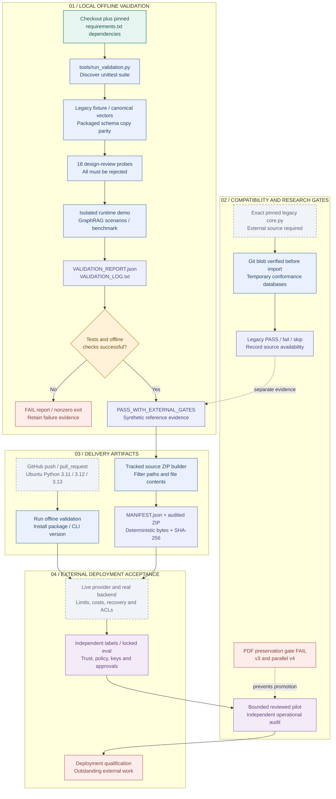

# 11 · Validation, packaging and delivery gates

[Atlas index](README.md) · [Mermaid source](11-validation-delivery.mmd) · [High-resolution PNG](png/11-validation-delivery.png)

The repository has a working offline validation runner, deterministic source packaging and an Ubuntu CI matrix. Production acceptance is a separate set of explicit external gates. This page describes the implemented commands and checked-in evidence at revision `d5ca636`; the documentation task did not rerun the test suite, contact model providers or deploy anything.

**Research gate remains failed:** source v3 and parallel v4 do not preserve the 91 previously correct expanded-v2 proposals. A passing offline report or source archive does not clear that gate.

## Workflow



## Offline validation

[`tools/run_validation.py:main()`](../../tools/run_validation.py#L41) discovers the complete `tests/` unittest suite and records each PASS, FAIL, ERROR or SKIPPED result. It then runs the legacy synthetic bundle fixture, canonical byte/hash vectors, packaged schema-copy equality, original review probes, isolated runtime demonstration, GraphRAG scenarios and synthetic benchmark.

The design-review probe stage requires all **18** original invalid cases to be rejected. It also writes `review/probe_results_after.json`. The runner records environment/dependency versions, test counts, skips, check results, external gates and claim limitations in `VALIDATION_REPORT.json` and `VALIDATION_LOG.txt`; demos and benchmark helpers update their respective output artifacts. This command writes validation artifacts.

When its enforced offline checks succeed, the report status is `PASS_WITH_EXTERNAL_GATES` and the process exits zero. Failure produces `FAIL` and exit one. The report explicitly records zero live-provider calls and zero production graph writes; temporary reference-database transactions are exercised.

```powershell
python -m pip install -r requirements.txt
python tools/run_validation.py
```

[The v4 integration receipt](../../review/first_page_parallel_v4/integration_result.json) contains a historical full-validation result of **527 tests run, 523 passed, 4 skipped**, with no failures or errors. These are checked-in evidence counts, not a fresh result for this documentation change. Optional PDF tests require PyMuPDF/Pillow; some environments also skip a symlink test without Windows symlink privilege. The pinned upstream legacy test needs externally supplied source.

## Legacy compatibility gate

[`tools/check_legacy.py`](../../tools/check_legacy.py) delegates to the `trace-gc check-legacy` command. [`load_pinned_core()`](../../trace_gc/legacy.py#L37) verifies the Git blob hash **before importing the exact verified bytes**. The required blob is `68217feec539d37e4a524432c93df035f9a0fe39`; this is a Git-object SHA-1 including its blob header, not raw-file SHA-256.

[`check_legacy()`](../../trace_gc/conformance.py#L24) exercises the external upstream implementation in temporary databases, including idempotency, withdrawal, reopen/audit and rollback/retry. The source is not vendored. The full-suite gate reads `TRACE_GC_LEGACY_CORE`; an absent source is reported as skipped/not run, not as established compatibility.

```powershell
python tools/check_legacy.py --core C:\authorized\upstream\core.py --output legacy-conformance.json
```

The path is a placeholder for the exact reviewed upstream file. The bridge targets its supported upstream transaction shapes and single accepted-graph authority; [deployment notes](../14_deployment.md) explain unsupported mixed add/retract and node-type migration cases.

## Source package and hosted CI

[`archive_bytes()`](../../tools/package_project.py#L80) uses Git-tracked files by default, filters unsafe/private paths and file contents, and regenerates the full root `MANIFEST.json`. [`package()`](../../tools/package_project.py#L141) writes a deterministic ZIP **outside** the repository, audits every member/hash and writes a ZIP SHA-256 sidecar. Configured paths, suffixes, file signatures and recognized secret patterns filter PDFs, model weights, databases, caches, selected credentials, symlinks and nested binary archives; this is not an exhaustive secret scanner. Untracked new documentation is not included until it becomes tracked. The explicit `--snapshot` mode is for an audited non-Git snapshot.

```powershell
python tools/validate_package.py
python tools/package_project.py --output ..\TRACE-GC-source.zip
python tools/package_project.py --audit ..\TRACE-GC-source.zip
```

`validate_package.py` validates the legacy synthetic package contract; it is not the ZIP member auditor. Source-package generation changes the root manifest. These are documented reproduction commands, not actions performed by this documentation task.

[The hosted workflow](../../.github/workflows/test.yml) triggers on push and pull request, with read-only repository permission and Ubuntu Python **3.11, 3.12 and 3.13**. Every matrix job installs `requirements.txt`, runs the offline validation runner, installs the package with `--no-deps` and checks `trace-gc --version`. [`pyproject.toml`](../../pyproject.toml) packages `trace_gc*`, schema resources and the CLI; optional research harnesses under `src/` remain repository tools. CI contains no deployment job or remote acceptance test.

## External acceptance remains explicit

| Gate | Required evidence before claiming completion |
| --- | --- |
| PDF preservation | Actual verified expanded200 replay preserving the 91 prior correct cases. Current v3 loses 68; parallel v4 loses 55. Unit fixtures and archived code cannot substitute for this gate. |
| Live provider | Approved account, pinned model, actual tokenizer, request limits, failure behavior and reconciled costs in the intended environment. Core validation uses mock transports. |
| Production calibration | Representative independent labels, a genuinely locked evaluation protocol, reviewed risk/coverage assumptions and an approved exactly matching qualification artifact. Included synthetic fixtures are not production qualification. |
| Application authority | Independently enrolled issuer capabilities, protected signing keys, exact service-selected policy hash and publication mode, operation-scoped authorization and the intended graph authority. The compiler service defaults to analysis-only. |
| Backend and retrieval deployment | Real adapter concurrency/recovery, authentication and ACLs, source status/epochs, provider deadlines, retention/backups and pinned embedding/tokenizer/model implementations. The reference backend is single-host SQLite. |
| Controlled pilot | A bounded reviewed pilot and independent operational audit. No checked-in release report establishes completed production deployment or distributed safety. |

These requirements come from [`docs/14_deployment.md`](../14_deployment.md), [GraphRAG security](../18_graphrag_security.md) and the runner's explicit `external_gates`/claim-limit fields. Existing signed receipts and reproducible artifacts support review; runtime authorization still depends on the application-owned trust and transaction policy.

Behavioral coverage includes [v3 package safety](../../tests/test_first_page_v3_io.py), [v4 package/freeze I/O](../../tests/test_parallel_source_io_v4.py) and the [conformance harness](../../trace_gc/conformance.py). For the PDF admission boundary continue with [09](09-pdf-evidence-review.md); for measured research limits see [10](10-research-experiments.md).
