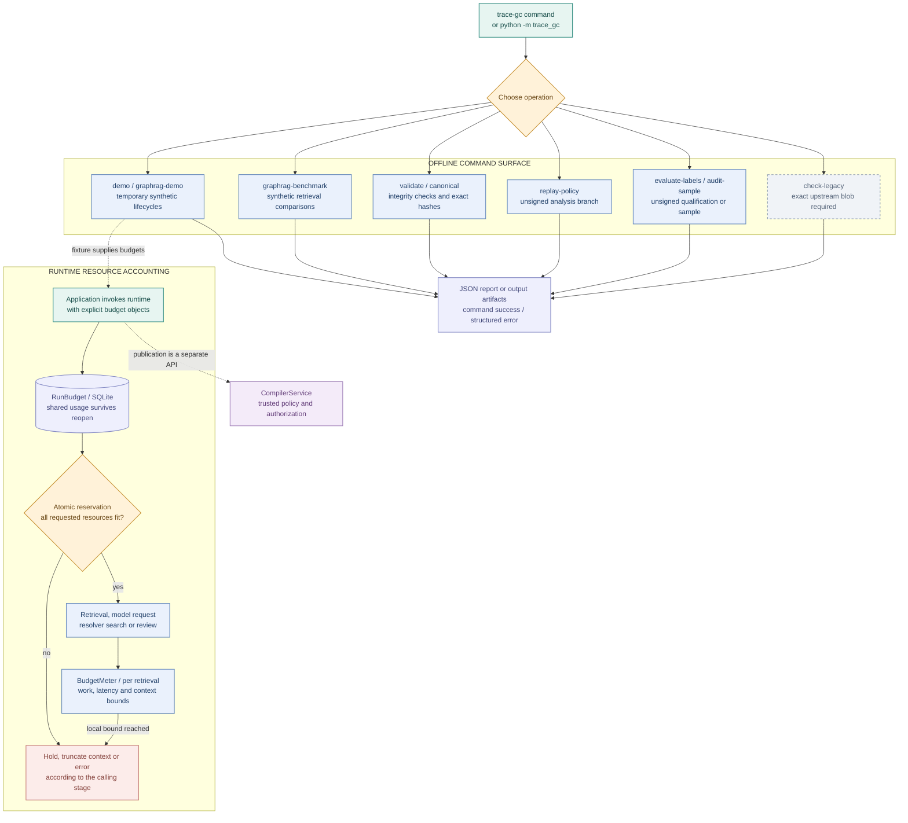

# 12 · Commands and resource budgets

[Atlas index](README.md) · [Mermaid source](12-commands-budgets.mmd) · [HD PNG](png/12-commands-budgets.png) · [Dark PNG](png/12-commands-budgets.dark.png)

The CLI exposes validation and reproducible experiments. An application invokes the trusted publication API with its own configuration and approvals. Resource usage is explicit: the shared `RunBudget` persists charges, while a `BudgetMeter` bounds an individual retrieval.

## Choose an entry point

| Command | Result and boundary |
| --- | --- |
| `python -m trace_gc demo --output <directory>` | Temporary sandbox lifecycle, bundle, public test keys and receipt report; fabricated responses and no provider calls. |
| `python -m trace_gc graphrag-demo --output <directory>` | Four synthetic retrieval/compilation/publication scenarios. |
| `python -m trace_gc graphrag-benchmark --output <directory>` | Synthetic retrieval and controlled-oracle comparisons. |
| `python -m trace_gc validate <bundle>` | Structural and provenance verification. Add `--trust <admin-file>` for independent checkpoint authentication. |
| `python -m trace_gc canonical <input.json>` | Canonical bytes and SHA-256 for `TRACE-C14N-1`. |
| `python -m trace_gc replay-policy <bundle> --policy <policy> --output <branch>` | Appended analysis policy branch with no new model inference and no authorization. |
| `python -m trace_gc evaluate-labels ...` | Unsigned qualification artifact; requires labels, scope, protocol, risk/coverage criteria and expiry. |
| `python -m trace_gc audit-sample <accepted-ids> --size <n> --seed <n> --output <sample>` | Deterministic random selection of accepted actions for independent audit. |
| `python -m trace_gc check-legacy --core <core.py>` | Pin verification and upstream conformance in temporary databases. |

`python -m trace_gc --help` and each command's `--help` are the authoritative argument lists. The CLI converts `ContractError` into a structured JSON failure and returns exit status 1; input errors are reported as `INPUT_ERROR`. Its `--version` exits through argparse. Research experiments have separate `python -m src...` entry points in [10 · Research experiments](10-research-experiments.md).

## Shared and local limits

| Scope | Accounted resources | Persistence and behavior |
| --- | --- | --- |
| `RunBudget` | `retrieval_requests`, `model_calls`, `retries`, `solver_expansions`, `review_actions`, `request_bytes` | SQLite row keyed by run ID. Limits must match on reopen. `consume_many` reserves all requested resources atomically under `BEGIN IMMEDIATE`; a failing reservation changes no usage. Callers charge the operations they initiate. |
| `BudgetMeter` | Cost units, candidates, nodes, edges, paths, communities, decisions, source spans, tokens, graph/vector queries and elapsed time | Local to one retrieval. Work limits raise `RETRIEVAL_BUDGET_EXHAUSTED`; `accept` can reject an item that would exceed context bounds. The retriever records why selection stopped. |
| Upstream acquisition | Tier, attempt and expansion budgets | `UpstreamGraphRAG.run` stops on declared outcomes or exhaustion and records the expansion history. It can request evidence without creating a graph mutation. |

Cost units are algorithm work units, not currency. The default retrieval token estimate counts canonical UTF-8 bytes conservatively; it is not a calibrated provider tokenizer. Model execution, byte budgets, solver exhaustion and retrieval truncation have their own caller-specific outcomes, shown in the detailed diagrams.

## Source evidence

- [`cli.parser` / `cli.main`](../../trace_gc/cli.py) and [`__main__.py`](../../trace_gc/__main__.py): command routing and errors.
- [`RunBudget`](../../trace_gc/budget.py): persistent configuration checks, atomic reservations and explicit close. Constructor failure closes SQLite before re-raising.
- [`BudgetMeter`](../../trace_gc/retrieval/budget.py) and [`RetrievalBudget`](../../trace_gc/retrieval/contracts.py): local retrieval bounds.
- [`TypeSafeAdapter`](../../trace_gc/adapter.py), [`solve`](../../trace_gc/resolver.py), [`UpstreamGraphRAG`](../../trace_gc/retrieval/planner.py): consuming stages.
- [`SharedBudgetTests`](../../tests/test_runtime_qualification.py): persistence, concurrent reservations, atomic multi-resource failure and invalid requests.

See [04 · Policy and publication](04-policy-publication.md) for application-owned write authority and [11 · Validation and delivery](11-validation-delivery.md) for runnable validation and packaging gates.
