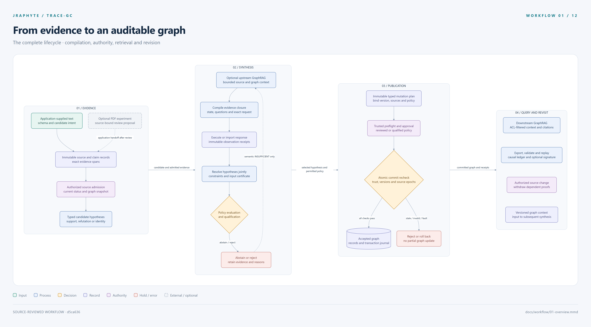

# TRACE-GC · Workflow atlas

**Evidence → compilation → observation → resolution → authorized graph → cited context**

This atlas documents source revision `d5ca636a48e963619f4c89e2958d0bb1a3e72f80`. Later runtime and research changes are not yet reflected in its source inventory; the current verification report records that drift.

Twelve source-reviewed chapters explain the complete implemented workflow, including failures, review gates, history and the experimental PDF paths. Each chapter includes editable Mermaid, source-code references and matching light/dark high-resolution exports.

[](png/01-overview.png)

Start with [01 · The complete lifecycle](01-overview.md), then follow the numbered chapters or choose a stage below. Open a PNG at full size to inspect fine details; the source Mermaid and SVG exports remain editable and scalable.

## Explore the workflow

| View | What it explains | High-resolution PNG |
| --- | --- | --- |
| [01 · Complete lifecycle](01-overview.md) | The four phases, application handoffs and graph feedback. | [Light](png/01-overview.png) · [Dark](png/01-overview.dark.png) |
| [02 · Evidence compilation](02-evidence-compilation.md) | Immutable records, typed dependencies, exact state and reproducible requests. | [Light](png/02-evidence-compilation.png) · [Dark](png/02-evidence-compilation.dark.png) |
| [03 · Observations and resolution](03-observations-resolution.md) | Live/recorded execution contracts, retry receipts, semantic outcomes and joint constraints. | [Light](png/03-observations-resolution.png) · [Dark](png/03-observations-resolution.dark.png) |
| [04 · Policy and publication](04-policy-publication.md) | Qualification, six operation types, trusted approvals, atomic commit and rollback. | [Light](png/04-policy-publication.png) · [Dark](png/04-policy-publication.dark.png) |
| [05 · History and replay](05-history-replay.md) | Signed checkpoints, bundle profiles, analysis branches, withdrawal and erasure. | [Light](png/05-history-replay.png) · [Dark](png/05-history-replay.dark.png) |
| [06 · Hybrid retrieval](06-hybrid-retrieval.md) | All 18 channels, access filters, ranking, conflict preservation, caches and limits. | [Light](png/06-hybrid-retrieval.png) · [Dark](png/06-hybrid-retrieval.dark.png) |
| [07 · Upstream compilation](07-upstream-compilation.md) | Graph-informed synthesis, semantic insufficiency, expansion and stopping rules. | [Light](png/07-upstream-compilation.png) · [Dark](png/07-upstream-compilation.dark.png) |
| [08 · Downstream answers](08-downstream-answers.md) | Context-only responses, canonical citations, provenance and consumer handoff. | [Light](png/08-downstream-answers.png) · [Dark](png/08-downstream-answers.dark.png) |
| [09 · PDF evidence review](09-pdf-evidence-review.md) | First-page source views, selector proposals, attributed review and payload admission. | [Light](png/09-pdf-evidence-review.png) · [Dark](png/09-pdf-evidence-review.dark.png) |
| [10 · Research experiments](10-research-experiments.md) | v1/v2/expanded/v3/v4 cohorts, frozen references, extraction and retrieval metrics. | [Light](png/10-research-experiments.png) · [Dark](png/10-research-experiments.dark.png) |
| [11 · Validation and delivery](11-validation-delivery.md) | Offline checks, optional conformance, CI, packaging and external qualification gates. | [Light](png/11-validation-delivery.png) · [Dark](png/11-validation-delivery.dark.png) |
| [12 · Commands and budgets](12-commands-budgets.md) | CLI routing, persistent run charges and local retrieval accounting. | [Light](png/12-commands-budgets.png) · [Dark](png/12-commands-budgets.dark.png) |

## Visual language

| Appearance | Meaning |
| --- | --- |
| Teal | Input supplied by an application or caller. |
| Blue | Implemented processing step. |
| Amber diamond | Decision or conditional gate. |
| Indigo | Immutable record, output or persisted graph state. |
| Plum | Trust, access, policy or authoritative validation boundary. |
| Coral | Hold, rejection, exhaustion, rollback or unavailable result. |
| Gray with dashed border | Optional component, external input or application handoff. |

Arrow labels state the relevant condition. Dotted arrows describe optional paths or explanatory associations. A plum box marks a boundary that the code checks; it does not by itself imply a cryptographic signature or an independent human reviewer. Chapter 09 makes the weaker PDF review receipt semantics explicit.

## Findings that shape the diagrams

The runtime keeps evidence, semantic observations, policy and graph publication as separate contracts. Compilation reconstructs source-bound inputs; publication repeats checks against current state inside a transaction. Retrieval supplies context and never owns publication authority.

PDF selectors remain experimental review-proposal producers. A reviewed PDF payload still needs an application handoff into the runtime. Downstream GraphRAG returns `CONTEXT_ONLY` with exact citations; an application provides any subsequent language-model answer generation.

The recorded PDF preservation gate is still failing: merged v3 loses **68 of 91** prior correct proposals, and parallel v4 loses **55 of 91**, on the known development regression set. The reports' precision figures apply to their proposed subsets and do not remove that recall/preservation defect. See [the recorded comparison and its limits](10-research-experiments.md).

The resolver certificate validates input bindings, feasibility and recorded objective arithmetic but does not independently rerun optimality. Trust/qualification registry persistence, live provider integration, independent production labels and deployed backend verification remain application or deployment work. The documentation describes these actual limits rather than treating offline checks as production qualification.

## Source and verification scope

Reviewed source revision: [`d5ca636`](https://github.com/CompleteDotTech/jraphyte/tree/d5ca636a48e963619f4c89e2958d0bb1a3e72f80). The [source coverage map](SOURCE_MAP.md) links every active runtime, research and tool Python module to its workflow chapters; [source-map.json](source-map.json) records their SHA-256 hashes. Historical archives and retained reports supply context, not additional active execution paths.

For this documentation change, verification covers all 12 Mermaid parses, 24 PNG exports, matching Markdown/Mermaid content, local link targets, source coverage and clean whitespace. The [render receipt](render-manifest.json) records exact dimensions and hashes; [verification.json](verification.json) records source/link/export checks. The renderer also checks that each SVG fits inside its export frame, and the outputs were visually reviewed. Runtime code was not changed, and the runtime suite was not rerun for this documentation-only change.

The checked-in v4 integration receipt records **527 tests run: 523 passed and 4 skipped**. These are historical execution counts. The reference package's separate live-provider, production-calibration, pinned-legacy and deployment gates remain explicit in [11 · Validation and delivery](11-validation-delivery.md).

## Rebuild the figures

The `.mmd` files are the editable source of truth. `render.mjs` copies their content into the corresponding Markdown Mermaid blocks, applies the shared palette and exports the light/dark figures. It uses an installed local Chrome/Chromium/Edge browser and does not load the TRACE-GC runtime, contact model providers or run research experiments.

The optional renderer dependencies are isolated under [`renderer/package.json`](renderer/package.json). With Node.js and a supported local browser installed, from the repository root:

```powershell
$env:PUPPETEER_SKIP_DOWNLOAD = 'true'
npm install --prefix docs/workflow/renderer
node docs/workflow/render.mjs
```

On a POSIX shell, use `PUPPETEER_SKIP_DOWNLOAD=true npm install --prefix docs/workflow/renderer` for the install step. `--browser <path>` selects a specific executable. `--modules <path-to-node_modules>` reuses an existing renderer installation. The exported receipt identifies the exact versions actually used.

```powershell
node docs/workflow/render.mjs --only 04-policy-publication --scale 3
python docs/workflow/verify.py
git diff --check
```

The default scale is 3. PNGs include a title, legend and source revision; paired SVGs in [`svg/`](svg/) preserve the underlying vector diagrams. Large detailed workflows use portrait exports to keep the full sequence readable without shrinking node text. PNG dimensions and byte hashes are recorded per file in `render-manifest.json`.

The root release `MANIFEST.json` and retained validation reports are not regenerated by documentation rendering. The normal packaging tool refreshes the release manifest when preparing a new package from tracked source.
